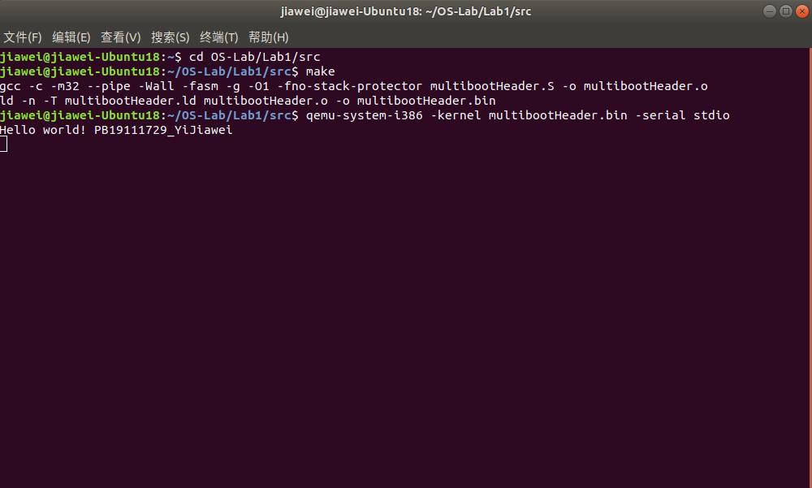

# 实验1 Multiboot启动

## 目录

- 原理说明
- 源代码说明
- 代码布局（地址空间）说明
- 编译过程说明
- 运行和运行结果说明
- 遇到的问题和解决方案

## 原理说明
- **Multiboot启动协议**

  Multiboot启动协议是一套多种操作系统共存时的启动引导协议。现今，许多操作系统都拥有自己的boot loader（即引导程序，负责载入最终的操作系统映像的一个或一组程序），若要使多种操作系统在机器上共存，则需要借助于特定的引导机制，显然，这很可能对使用多操作系统的便利性与兼容性带来影响。为解决这一问题，Multiboot启动协议应运而生。简单来讲，这份协议明确了boot loader与操作系统间的接口，所有符合协议规范的boot loader可以读取所有所有符合协议规范的操作系统。

  本次实验采用的协议版本为Multiboot Specification version 0.6.96，实验目的为实现Multiboot header部分，并在vga屏幕和串口上输出特定内容。本次实验要求比较简单，我们只需实现最简单的Multiboot header格式要求即可。

  最简单的Multiboot Header要求如下：
  | Offset 偏移量 | Type 数据类型 | Filed 域名称 | Note 备注                                  |
  | ------------- | ------------- | ------------ | ------------------------------------------ |
  | 0             | u32           | magic        | 必要项，值应为0x1BADB002                   |
  | 4             | u32           | flags        | 必要项，在此次实验中值可以为0              |
  | 8             | u32           | checksum     | 必要项，应满足magic + flags + checksum = 0 |
  | ……            | ……            | ……           | ……                                         |

  即一个Multiboot Header应至少具有以上共12个字节的内容。下面是Header中各个域的作用：

  - **magic**

    magic为魔数域，其值是协议开发者人为规定的，作为Multiboot Header的标志。

  - **flags**

    flags域指出OS映像需要boot loader提供或支持的一些特性。本实验中，可以让flags的值为0，以后我们将对flags有更深入的了解。

  - **checksum**

    checksum域为校验和，顾名思义，用于校验。当满足magic + flags + checksum = 0时，校验通过，Multiboot Header构建完成。

  协议要求Multiboot Header必须完整地包含在OS映像前8192个字节内，且通常来说位置要靠前越好。

- **QEMU**

  QEMU（Quick EMUlator）是一个通过软件实现的虚拟化模拟器，几乎可以模拟任何硬件设备。在本实验中，QEMU为我们提供了一个虚拟的裸机环境，最终编写好的Multiboot Header内核将在QEMU环境中运行。

- **VGA输出**

  本实验直接向VGA显存写入内容来实现字符输出。

  实验中字符界面规格为：25行80列，VGA显存的范围为：`0xB8000 + 0x1000`，我们从起始地址0xB8000开始写入要显示的文本。

  VGA显存显示一个字符需要两个字节，一个用于存放字符的ASCII码，另一个用于存放该字符的显示属性（如前景色、背景色等）。

  | Attribute 显示属性 | Character 字符的ASCII码 |
  | ------------------ | ----------------------- |
  | 15~8               | 7~0                     |

  显示属性Attribute的内容规定如下：

  | Blink 闪烁 | Background Color 背景色 | Foreground Color 前景色 |
  | ---------- | ----------------------- | ----------------------- |
  | 7          | 6~4                     | 3~0                     |

  写显存输出字符属于内存映射I/O，因此使用mov进行输出。

- **串口输出**

  在QEMU中，即使OS没有对波特率等进行初始化，也能正确输出。

  串口端口地址为0x3F8。串口输出属于端口映射I/O，因此调用out进行串口输出。

## 源代码说明

- **Multiboot Header构建**

  - **参数定义**

    ```x86asm
    MULTIBOOT_HEADER_MAGIC = 0x1BADB002
    MULTIBOOT_HEADER_FLAGS = 0x00000000
    MULTIBOOT_HEADER_CHECKSUM = -(MULTIBOOT_HEADER_MAGIC + MULTIBOOT_HEADER_FLAGS)
    ```

    在源码开头部分，即定义Multiboot Header要求的magic，flgas与checksum域。
    magic域定义为指定的值0x1BADB002，flags域定义为0，checksum域则定义为-(magic + flags)，以满足magic + flags + checksum = 0的要求。


  - **实际声明**

    ```x86asm
    .section ".multiboot_header"
    	.long MULTIBOOT_HEADER_MAGIC
    	.long MULTIBOOT_HEADER_FLAGS
    	.long MULTIBOOT_HEADER_CHECKSUM
    ```
  
    开辟出一段名为".multiboot_header"的section（语句段），利用定义好的参数，通过 .long 语句声明 Multiboot Header 的三个域。

    直接使用数值来声明也是允许的，如：

    ```x86asm
    # multiboot_header_magic
    .long 0x1BADB002
    ```

- **VGA输出**

  构建好Multiboot协议头后，我们即可进行VGA输出。

  - **VGA显存初始化**

    实验中，发现QEMU本身会自动输出一些字符，占用了一部分目标显存。我们可以向显存写入新内容以覆盖这些字符，也可以在写入前进行初始化来擦除这些字符。我选择对显存进行初始化。

    ```x86asm
    .text
    .code32
    start:
	  	movl $0, %eax
    clean_loop:
    	movl $0xB8000, %ebx
    	movl $0, (%ebx, %eax, 4)
    	addl $1, %eax
    	cmpl $0x1000, %eax
    	jl clean_loop
    ```
  
    代码中，用到两个寄存器eax和ebx作为临时变量的存储。

    ebx存储显存的起始地址，即0xB8000；eax存储循环变量index，初始为0，每次循环加1。

    每次循环的语句块标号为clean_loop。在一次循环中，将 %ebx + 4 * %eax 地址中的内容清零。

    显存的范围是 `0xB8000 + 0x1000`，因此取循环变量范围为0~0x1000，当%eax小于0x1000，跳转进入clean_loop，否则结束循环。用两行语句控制此过程：

    ```x86asm
    cmpl $0x1000, %eax
    jl clean_loop
    ```

    循环结束后，全部的VGA显存都被初始化。

  - **写VGA显存**

    向目标地址写入内容，使用movx语句。movx语句的格式为：
    
    ```x86asm
    movx source, destination
    ```

    其作用为将source的值写入destination。movl适用于32位的值，因此我们用movl语句向显存写入内容。

    接下来，查阅所要显示字符的ASCII码，遵照实验原理部分VGA输出字符的格式要求，逐个输出字符即可。

    ```x86asm
    vga_output:
		movl $0x2f652f48, 0xB8000
		movl $0x2f6C2f6C, 0xB8004
		movl $0x2f202f6F, 0xB8008
		...
    ```
- **串口输出**

    实验原理部分已经提过，使用outb进行串口输出。我们只需提供outb所需的两个参数。

    ```x86asm
    movw $0x3F8, %dx
    ```

    上述代码将串口端口地址0x3F8存入dx寄存器。

    ```x86asm
    movb $0x48, %al
    outb %al, %dx
    movb $0x65, %al
    outb %al, %dx	
    ...
    ```

    上述代码将所要显示字符的ASCII码存入寄存器al，再使用outb进行输出。最终输出结果为H和e。

- **停机**

    ```x86asm
    hlt
    ```

    使用此语句可以使程序停止运行，处理器进入暂停状态。

## 代码布局（地址空间）说明

代码布局（地址空间）由链接描述文件（.ld文件）中的SECTIONS部分决定。

```livescript
SECTIONS {
    . = 1M;
    .text : {
        *(.multiboot_header)
        . = ALIGN(8);
        *(.text)
    }
}
```

根据.ld文件，输出文件.text代码段的起始偏移量为1M，即从内存 1M 处开始存储代码段。.text代码段含有两部分：

第一部分为multibootHeader.S中的.multiboot_header代码段，构建了Multiboot Header，以供Qemu识别。此段总长度为12字节。

第二部分为multibootHeader.S中的.text代码段，按八字节对齐，因此偏移量为16。

用表格表示：

| Offset（Base = 1M） | Section Name      | Note                            |
| ------------------- | ----------------- | ------------------------------- |
| 0                   | .multiboot_header | multiboot协议头部，供QEMU识别   |
| 16                  | .text             | 代码段，实现VGA输出、串口输出等 |

## 编译过程说明

Makefile文件内容如下：

```makefile
ASM_FLAGS = -m32 --pipe -Wall -fasm -g -O1 -fno-stack-protector

multibootHeader.bin: multibootHeader.S
	gcc -c ${ASM_FLAGS} multibootHeader.S -o multibootHeader.o
	ld -n -T multibootHeader.ld multibootHeader.o -o multibootHeader.bin

clean:
	rm -rf ./multibootHeader.bin ./multibootHeader.o
```

可以看出，编译过程为先用gcc从multibootHeader.S源文件编译出multibootHeader.o文件，再根据链接描述文件multibootHeader.ld从multibootHeader.o文件链接得到multibootHeader.bin文件。

ASM_FLAGS是一个变量，它定义了本次编译中gcc指令的一系列参数。

有了makefile文件后，在ubuntu的shell中，进入源码所在文件夹，输入指令

```shell
make
```

即可完成编译。

此外，makefile文件中包含了clean部分。如果输入指令

```shell
make clean
```

可以删除掉之前编译生成的multibootHeader.o与multibootHeader.bin文件。

## 运行和运行结果说明

在ubuntu的shell中，进入源码所在目录，编译生成multibootHeader.bin文件后，输入指令

```shell
qemu-system-i386 -kernel multibootHeader.bin -serial stdio
```

即可用QEMU运行我们生成好的multiboot OS核multibootHeader.bin。

qemu-system-i386 指定了处理器的类型。

-kernel multibootHeader.bin 指出了要运行的OS核文件。

-serial stdio 表示将串口输出引向标准I/O，即ubuntu的shell中。

最终运行的结果如图所示，QEMU图形化界面被启动，输出了预期字符内容，串口输出也正常。

  

  