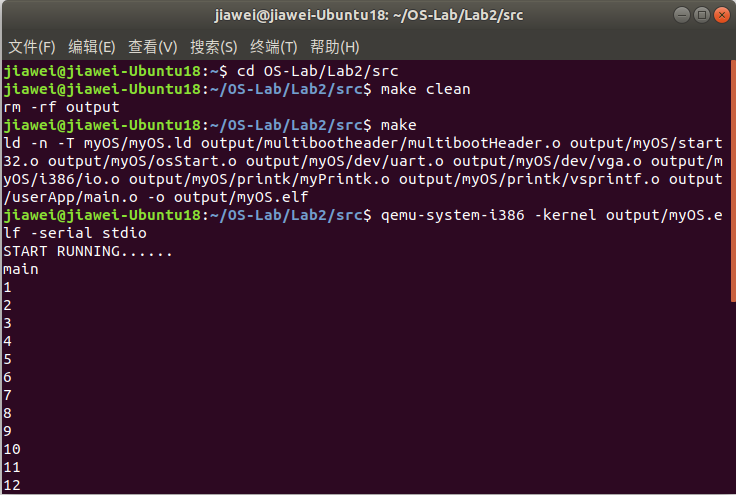

# 实验2 Multiboot2myMain

## 目录

- 原理说明
- 主要功能模块及其实现
- 源代码说明
- 代码布局（地址空间）说明
- 编译过程说明
- 运行和运行结果说明
- 遇到的问题和解决方案

## 原理说明

- **操作系统结构框图及其概述**

  此次实验中，我们将用C语言实现操作系统myOS中的软件部分。自下而上，操作系统软件结构分为：

  1. I/O端口，通过少量内嵌汇编完成。

  2. UART和VGA输出模块，基于I/O端口与写显存实现。

  3. 格式化输出模块，包含myPrintk、myPrintf以及它们所需要的格式化字符串处理模块vsprintf。

  4. 用户模块userApp，用户可调用myPrintk、myPrintf等实现格式化字符串的输出。

  myOS的软件结构框图如下：

  

- **主流程及其实现**
  
  在实验一中，我们通过纯汇编的方式实现了简单的Multiboot Header。而在本次实验中，我们则需要从Multiboot Header的汇编部分衔接到c语言实现的myOS软件部分。这一过程可通过汇编语句call来实现

  总的来说，系统启动和运行的流程图如下：

  

  1. 从multibootHeader.S的start位置开始，验证multiboot header，开始引导系统。

  2. 通过call _start跳转至start32.S，构建堆栈，初始化bss段作为后面未初始化变量的存储块。

  3. 通过call osStart跳转至osStart.c，开始运行系统，内核态地输出系统运行的提示字符。

  4. osStart.c调用main.c的myMain()函数，运行用户程序。

  5. 用户程序main.c运行结束后，通过return返回osStart.c，准备结束系统的运行。

  6. osStart.c通过while(1)死循环进入停机状态。

- **UART输出**

  本次实验的UART串口输出与第一次实验的类似，将串口引向stdio，不需要考虑初始化。只是实现方式从直接的汇编语句变为了c语言内嵌汇编。先通过内嵌汇编实现inb与outb函数，再通过这两个函数实现串口输出。

- **VGA输出**

  - **写入显存**

    此次实验的VGA输出字符方式依然为写显存，但由于是通过c语言实现，不再需要汇编或内嵌汇编，而是通过c语言的指针来实现。

    指针变量的值即为它所指的位置的首地址，而c语言各种数据类型具有不同的长度，通过它们的指针可以灵活地修改显存。

  - **光标位置设置**

    光标位置（现位置与起始位置之差）为16位无符号整数，高八位为行号，存储于0xE寄存器，低八位为列号，存储于0xF寄存器。

    读写光标位置需要用到两个显卡相关端口：索引端口0x3D4与数据端口0x3D5。例如，当想要修改行号时，将0xE写入0x3D4端口，将行号数据写入0x3D5端口，即可修改行号。由于是端口输入输出，写入与读出也是通过outb与inb实现的。

## 主要功能模块及其实现

- **Multiboot Header**

  实验二在实验一的基础上进行，指的就是本部分。我使用的是自己在实验一中的代码，并结合助教提供的参考代码进行了少量修改。

  ```x86asm
  .globl start

  # multiboot specification version 0.6.96
  MULTIBOOT_HEADER_MAGIC = 0x1BADB002
  MULTIBOOT_HEADER_FLAGS = 0x00000000
  MULTIBOOT_HEADER_CHECKSUM = -(MULTIBOOT_HEADER_MAGIC + 
                                MULTIBOOT_HEADER_FLAGS)

  .section ".multiboot_header"
  .align 4
    # multiboot header
    .long MULTIBOOT_HEADER_MAGIC
    .long MULTIBOOT_HEADER_FLAGS
    .long MULTIBOOT_HEADER_CHECKSUM

  .text
  .code32
  start:
    call _start
    hlt
  ```

  结合参考代码可以看出，我实验一的代码基本符合要求，但在一些细节方面还是存在问题，如section段的声明语句，等等。这些都是对汇编语言的不熟悉造成的。

- **I/0端口**

  读写端口的字节数据。

  - **inb**

    ```c
    // read a byte from the port
    unsigned char inb(unsigned short int port_from) {
        unsigned char value;
        __asm__ __volatile__ ("inb %w1, %b0": "=a"(value): 
                              "Nd"(port_from));
        return value;
    }
    ```

    通过c语言内嵌汇编实现。

    %w1为读取的端口。它代表语句中第二个c语言变量port_from，w表示其长度为16，N表示立即数，d表示先存入寄存器%edx，再作为指令的操作数。

    %b0为读取内容的存放处。它代表语句中第一个c语言变量value，b表示其长度为8，=a表示先读入寄存器%eax，再将其写入c语言变量value中。

  - **outb**

    ```c
    // write a byte to the port
    void outb(unsigned short int port_to, unsigned char value) {
        __asm__ __volatile__ ("outb %b0, %w1":: "a"(value), "Nd"(port_to));
    }
    ```

    同样通过内嵌汇编实现，与inb原理类似。

- **UART输出模块**

  单次或循环调用outb实现。

  - **宏定义**

    只有一个宏UART_BASE，为串口的端口地址。

    ```c
    #define UART_BASE 0x3F8
    ```

  - **输出字符**

    ```c
    // put a char to uart
    void uart_put_char(unsigned char c) {
        outb(UART_BASE, c);
    }
    ```

  - **输出字符串**

    ```c
    // put a string to uart
    void uart_put_chars(char *str) {
        int i;
        for (i = 0; str[i] != '\0'; i++) {
            outb(UART_BASE, str[i]);
        } 
    }
    ```

- **VGA输出模块**

  - **宏定义**

    ```c
    #define VGA_BASE 0xB8000 // VGA基地址
    #define VGA_SIZE 0x1000 // VGA显存范围
    #define VGA_SCREEN_WIDTH 80 // 屏幕宽
    #define VGA_SCREEN_HEIGHT 25  // 屏幕高

    #define CURSOR_LINE_REG 0xE // 光标位置行号寄存器
    #define CURSOR_COL_REG 0xF // 光标位置列号寄存器
    #define CURSOR_INDEX_PORT 0x3D4 // 光标位置索引端口
    #define CURSOR_DATA_PORT 0x3D5 // 光标位置数据端口
    ```

  - **设置光标位置**

    ```c
    // set the cursor to a sepecific position
    void set_cursor_pos(int pos) {
        // set cursor line position
        outb(CURSOR_INDEX_PORT, CURSOR_LINE_REG);
        outb(CURSOR_DATA_PORT, (pos >> 8) & 0xFF);
        // set cursor column position
        outb(CURSOR_INDEX_PORT, CURSOR_COL_REG);
        outb(CURSOR_DATA_PORT, pos & 0xFF);
    }
    ```

    设置行号：将行号寄存器写入索引端口，然后将光标位置的高八位写入数据端口。

    设置列号：将列号寄存器写入索引端口，然后将光标位置的低八位写入数据端口。

  - **清屏**

    ```c
    // clear the screen
    void clear_screen(void) {
        int *address_writer32;
        int i = 0;
        while (i < VGA_SIZE) {
            // fill the screen with spaces
            address_writer32 = (int*)(VGA_BASE + i);
            *address_writer32 = 0x0F200F20;
            i += 4;
        }
        cursor_pos = 0;
        set_cursor_pos(cursor_pos);
    }
    ```

    将屏幕用黑底白字空格填满。需要注意的是光标也会受到字符的颜色影响，因此要选择黑底白字。

    用int指针写显存，每次写2个空格，长度32，占用4个地址。指针变量的值address_writer32对应显存地址，而其指向的内容*address_writer32则对应显存内容。
    
    i最终是与VGA_SIZE作比较，VGA_SIZE为全屏可容纳字符数的2倍，每次循环处理2个字符位，因此每次循环后i加4。

    清屏结束后，将光标置于0位置。

  - **滚屏**

    滚屏的原理就是不断将下一行的字符复制到本行，最终清空最后一行。

    ```c
    // scroll the screen
    void scroll_screen(void) {
        int *address_reader32, *address_writer32;
        int i = 0;
        while (i < cursor_pos) {
            address_writer32 = (int*)(VGA_BASE + i * 2);
            if (i < cursor_pos - VGA_SCREEN_WIDTH) {
                // copy the data from the next line
                address_reader32 = (int*)(VGA_BASE + i * 2 + 
                                          VGA_SCREEN_WIDTH * 2);
                *(address_writer32) = *(address_reader32);
            }
            else
                // clear the last line
                *(address_writer32) = 0x0F200F20;
            i += 2;
        }
        cursor_pos -= VGA_SCREEN_WIDTH;
        set_cursor_pos(cursor_pos);
    }
    ```

    复制时，设置一个32位指针专门读下一行的显存内容，设置一个32位指针将读取到的内容写入到本行对应位置。

    清空最后一行即用黑底白字的空格填满。

    每次循环，处理2个字符位置。i最终是与光标位置作比较，其单位长度为一个字符位，因此每次循环i加2。

    滚屏结束后，设置光标到正确的位置。

  - **输出字符**

    ```c
    // put a single char to vga
    void append_char(unsigned char c, int color) {
        // whether need to scroll the screen
        while (cursor_pos / VGA_SCREEN_WIDTH >= VGA_SCREEN_HEIGHT)
            scroll_screen();

        // put the char to cursor_pos
        unsigned char *address_writer8;
        address_writer8 = (unsigned char*)(VGA_BASE + cursor_pos * 2);
        *address_writer8 = c;
        address_writer8 = (unsigned char*)(VGA_BASE + cursor_pos * 2 + 1);
        *address_writer8 = (unsigned char)color;
        cursor_pos++;
        set_cursor_pos(cursor_pos);
    }
    ```

    输出单个字符到光标位置。输出前先判是否需要滚屏。

    之后用一个8位指针，依次输出字符的ascii码和颜色相关数据。结束后，设置光标到正确位置。

  - **输出字符串与转义字符处理**

    ```c
    // append a string to vga
    void append2screen(char *str,int color){ 
        for (int i = 0; str[i] != '\0'; i++) {
            switch (str[i]) {
                case '\t':
                    // move the cursor forward for 4 chars' length
                    cursor_pos += 4;
                    set_cursor_pos(cursor_pos);
                    while (cursor_pos / VGA_SCREEN_WIDTH >= 
                           VGA_SCREEN_HEIGHT)
                        scroll_screen();
                    break;
                    
                case '\n':
                    // move the cursor to the start of next line
                    cursor_pos = cursor_pos + VGA_SCREEN_WIDTH - 
                                 cursor_pos % VGA_SCREEN_WIDTH;     
                    set_cursor_pos(cursor_pos);
                    while (cursor_pos / VGA_SCREEN_WIDTH >= 
                           VGA_SCREEN_HEIGHT)
                        scroll_screen();
                    break;
                    
                case '\f':
                    // a new page = clear the screen
                    clear_screen();
                    break;
                    
                case '\r':
                    // set the cursor to the start of this line
                    cursor_pos = cursor_pos - 
                                 cursor_pos % VGA_SCREEN_WIDTH;
                    set_cursor_pos(cursor_pos);
                    break;
                    
                case '\b':
                    // set the cursor to the pervious line 
                    // if it is not at the start of a line
                    if (cursor_pos % VGA_SCREEN_WIDTH != 0) {
                        cursor_pos--;
                        set_cursor_pos(cursor_pos);
                    }
                    break;
                    
                case '\v':
                    // put spaces until the next line's this column
                    cursor_pos += VGA_SCREEN_WIDTH;
                    set_cursor_pos(cursor_pos);
                    while (cursor_pos / VGA_SCREEN_WIDTH >= 
                           VGA_SCREEN_HEIGHT)
                        scroll_screen();
                    break;
                    
                default:
                    append_char(str[i], color);
                    break;
            }
        }
    }
    ```

    循环调用append_char来输出字符串。
    
    输出时，需要考虑转义字符的处理：

    制表符\t：光标后移四位，移动后需要判断一下是否需要滚屏。

    换行符\n：光标移动到下一行开头，移动后需要判断一下是否需要滚屏。

    换页符\f：换页，本实验中效果等同于清屏。

    回车符\r：将光标移至本行开头。

    退格符\b：将光标移至前一列，如果它没有处于本行开头。
    
    垂直制表符\v：光标移动到下一行的本列处，移动后需要判断一下是否需要滚屏。

    输出特殊字符的\\?，\\'等：不用特别处理，c语言会自动处理。

- **格式化输出模块**

  ```c
  char kBuf[400];
  int myPrintk(int color, const char *format, ...) {
      int i;
      va_list args;
      
      va_start(args, format);
      i = vsprintf(kBuf, format, args);
      va_end(args);
      append2screen(kBuf, color);
      uart_put_chars(kBuf);
      
      return i;
  }
  ```

  上述代码为内核态格式化输出。所用缓冲区为kBuf。

  运用了c语言可变参数相关的内容。先通过vsprintf将所给字符串进行格式化处理，处理后的字符串存于kBuf中，然后将kBuf分别在VGA和UART上输出。

  vsprintf的代码移植自linux kernel version 1.1.95。

  而对于用户态输出函数myPrintf，只是将kBuf换为用户态缓冲区uBuf即可。

## 源代码说明

  - **目录组织**

    ```c
    src
    |_____multibootheader
    |     |_____multibootHeader.S //multiboot启动头
    |_____myOS
    |     |_____dev
    |     |     |_____uart.c //串口输出模块
    |     |     |_____vga.c //vga输出模块
    |     |_____i386
    |     |     |_____io.c //I/O端口模块
    |     |     |_____io.h
    |     |_____printk
    |     |     |_____myPrintk.c //格式化输出模块
    |     |     |_____vsprintf.c
    |     |_____osStart.c //系统启动程序
    |     |_____start32.S //数据段、bss段、堆栈空间分配
    |_____userApp
          |_____main.c //用户程序
    ```

  - **Makefile组织**

    ```
    src
    |_____myOS
    |     |_____dev
    |     |_____i386
    |     |_____printk
    |_____userApp
    ```  

## 代码布局（地址空间）说明

代码布局（地址空间）由链接描述文件（.ld文件）中的SECTIONS部分决定。

```livescript
OUTPUT_FORMAT("elf32-i386", "elf32-i386", "elf32-i386")
OUTPUT_ARCH(i386)
ENTRY(start)

SECTIONS {
	. = 1M;
	.text : {
	    *(.multiboot_header) 
		. = ALIGN(8);
		*(.text)
	}
	
	. = ALIGN(16);
	.data		: { *(.data*) }
	
	. = ALIGN(16);
	.bss		:
	{
		__bss_start = .;
		_bss_start = .;
		*(.bss)
		__bss_end = .;
	}
	. = ALIGN(16);
	_end = .;
	. = ALIGN(512);	
}
```

用表格直观表示：

| Offset | field      |  Note | 
| ------------------- | ----------------- | -----|
| 1M                   | .text              | 代码段   |
| ALIGN(16)           | .data              | 数据段   |
| ALIGN(16)           | .bss             | bss段，存储未初始化的变量   |
| ALIGN(16)           |               | 堆栈起始地址 |

ALIGN(16)表示起始地址按16字节对齐。


## 编译过程说明

```makefile
MULTI_BOOT_HEADER=output/multibootheader/multibootHeader.o
include $(SRC_RT)/myOS/Makefile
include $(SRC_RT)/userApp/Makefile

OS_OBJS       = ${MYOS_OBJS} ${USER_APP_OBJS}

output/myOS.elf: ${OS_OBJS} ${MULTI_BOOT_HEADER}
	${CROSS_COMPILE}ld -n -T myOS/myOS.ld ${MULTI_BOOT_HEADER} ${OS_OBJS} -o output/myOS.elf

output/%.o : %.S
	@mkdir -p $(dir $@)
	@${CROSS_COMPILE}gcc ${ASM_FLAGS} -c -o $@ $<

output/%.o : %.c
	@mkdir -p $(dir $@)
	@${CROSS_COMPILE}gcc ${C_FLAGS} -c -o $@ $<

clean:
	rm -rf output

```

编译过程分为两步：

1. 编译汇编.S源文件与c语言.c源文件，生成.o文件。这一步需要包括各目录下的makefile文件。

2. 将各.o文件进行链接，生成myOS.elf文件。

## 运行和运行结果说明

编译完成后，在src目录下，运行指令为：

```sh
qemu-system-i386 -kernel output/myOS.elf ‐serial stdio
```

当然，也可以通过脚本一键编译与运行：

```sh
./source2run.sh
```

source2run.sh的具体内容如下:

```sh
SRC_RT=$(shell pwd)
echo $SRC_RT

make clean

make

if [ $? -ne 0 ]; then
	echo "make failed"
else
	echo "make succeed"
	qemu-system-i386 -kernel output/myOS.elf -serial stdio
fi
```

最终运行结果如下所示:




可以看到，编译与运行过程都正常，VGA与串口都输出了预期内容。

## 遇到的问题和解决方案

- 不知道光标位置的具体存放方式
  
  查阅资料后得知寄存器存储的是光标位置与初始位置之差，高八位存于0xE，低八位存于0xF。

- 通过内嵌汇编mov写显存出现各种语法错误

  我对汇编和内嵌汇编的了解还很少。在助教的提示下，选择用c语言指针写显存，放弃内嵌汇编。
