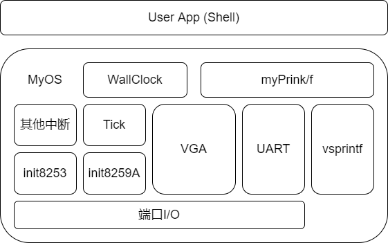
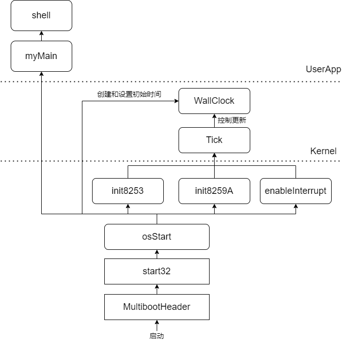
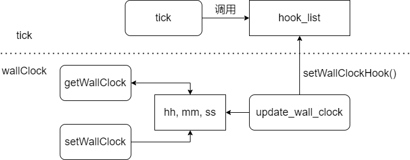
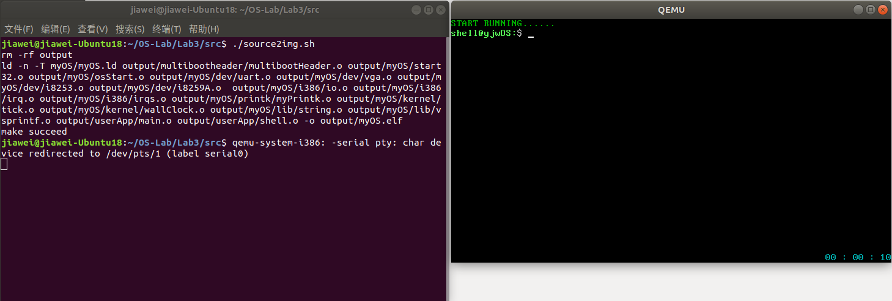
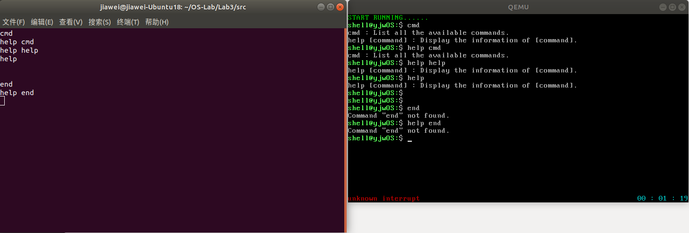

# 实验3 shell & interrupt & timer

## 目录

- 原理说明
- 主要功能模块及其实现
- 源代码说明
- 代码布局（地址空间）说明
- 编译过程说明
- 运行和运行结果说明
- 遇到的问题和解决方案

## 原理说明

- **软件结构框图及其概述**

  软件结构框图如下：

  

  概述：

  1. 最底层为端口I/O，通过内嵌汇编完成，实现对硬件端口的输入输出。

  2. 基于端口I/0实现VGA输出程序、UART输出程序、i8259和i8253初始化程序。

  3. 基于已经初始化的i8259、i8253，实现时钟中断Tick和其他中断（本实验中认为是unknown interrupt，忽略）的处理；
  
     基于VGA输出和格式化字符串处理程序vsprintf，实现myPrintk和myPrintf（上次实验为测试方便，将串口输出也绑定到了myPrintk/f中，本次我将它们进行了分离，myPrintk/f专门用于vga输出）;

     基于Tick和VGA输出，实现wallClock墙钟。

  4. 用户模块userApp，可调用myOS中封装好的、较不底层的函数，实现shell功能。

- **主流程及其实现**

  系统启动和运行的主流程如下：

  

  1. 从multibootHeader.s开始，验证multiboot header，开始引导系统。

  2. 跳转至start32.s，通过汇编，构建堆栈，初始化bss段，初始化中断描述符表idt。

  3. 跳转至osStart.c，开始运行myOS，初始化i8259和i8253，开中断，从而实现时钟中断Tick。

     osStart.c初始化墙钟，墙钟的更新由Tick维护，墙钟和Tick都是Kernel的一部分。

     osStart.c开始运行用户程序myMain()。

  4. 用户程序启动shell。

## 主要功能模块及其实现

  本次实验3，是在我自己的实验2代码基础上修改的。

  - **中断描述符表**

    中断描述符表将中断和它们的处理过程联系起来。如果我们已经编写好了中断处理过程，将其设置为中断描述符表的一个表项，则当中断发生时，系统就会跳转到对应的中断处理过程处，进行处理。

    中断描述符表的初始化和表项分配在系统启动过程中完成，其汇编代码在start32.s中。

    - **内存空间分配**

      在数据段为中断描述符表分配内存空间，表中共有256个描述符，每个描述符为8个字节。

      ```x86asm
      .data
      # IDT
      .p2align 4
      .globl IDT
      IDT:
          .rept 256
          .word 0, 0, 0, 0
          .endr
      idtptr:
          .word (256 * 8 - 1)
          .long IDT
      ```

    - **表项初始化**

      记`ignore_int1`为中断的默认处理过程（具体来讲为忽略中断），先将全部256个表项设置为`ignore_int1`：

      ```x86asm
      setup_idt:
          movl $ignore_int1, %edx
          movl $0x00080000, %eax /* selector */
          movw %dx, %ax
          movw $0x8E00, %dx /* interrupt gate - dpl=0, present */
          movl $IDT, %edi
          mov $256, %ecx
      rp_sidt:
          movl %eax, (%edi)
          movl %edx, 4(%edi)
          addl $8, %edi
          dec %ecx
          jne rp_sidt
      ```

    - **时钟中断表项设置**

      表项全部初始化为默认处理过程后，就可以开始分配具体的中断处理过程。本次只需要设置一个时钟中断处理过程`time_interrupt`。

      中断包括异常与中断两类，内部异常由32个，中断号为0 ~ 31，中断则从第33个开始，中断号为32。因此，本次实验，我们将`time_interrupt`设置到表项32。

      ```x86asm
      setup_time_int_32:
          movl $time_interrupt, %edx
          movl $0x00080000, %eax /* selector： 0x0010 = cs */
          movw %dx, %ax
          movw $0x8E00, %dx /* interrupt gate - dpl=0, present */
          movl $IDT, %edi
          addl $(32*8), %edi
          movl %eax, (%edi)
          movl %edx, 4(%edi)
          ret
      ```

  - **中断处理**

    此部分内容与中断处理相关，其代码在irq.s与irqs.c中。

    - **开关中断**

      通过汇编`sti`与`sli`来开、关系统对外界中断的响应：

      ```x86asm
      .globl enableInterrupt
      enableInterrupt:
          sti
          ret

      .globl disableInterrupt
      disableInterrupt:
          cli
          ret
      ```

      在以上汇编代码上封装一层C函数，以便调用。

      ```c
      void enable_interrupt(void) {
          __asm__ __volatile__("Call enableInterrupt");
      }

      void disable_interrupt(void) {
          __asm__ __volatile__("Call disableInterrupt");
      }
      ```

    - **默认处理过程**

      此中断处理过程即上文提到的`ignore_int1`，发生时，调用C函数`ignoreIntBody()`，在VGA左下角输出"unknown interrupt"：

      ```x86asm
      .p2align 4
      .globl ignore_int1
      ignore_int1:
          cld
          pusha
          call ignoreIntBody
          popa
          iret
      ```

      ```C
      void ignoreIntBody(void) {
          put_chars("unknown interrupt", 0x4, VGA_SCREEN_HEIGHT - 1, 0);
      }
      ```

    - **时钟中断处理过程**

      此中断处理过程即上文提到的`time_interrupt`，发生时，调用C函数`timeIntBody()`，此C函数再调用`tick()`，进行中断处理。`tick()`具体内容将在下文提及。

      ```x86asm
      .p2align 4
      .globl time_interrupt
      time_interrupt:
          cld
          pushf
          pusha
          call timeIntBody
          popa
          popf
          iret
      ```

      ```C
      void timeIntBody(void) {
          tick();
      }
      ```

  - **中断控制器初始化**

    - **i8259**

      i8259是可编程控制器。两片i8259级联后，连接在CPU上。外设的输出线连接在中断控制器的输入引脚上，从而控制中断。i8259还可通过屏蔽字节来开关某个外设的中断（端口`0x21`和`0xA1`）。

      根据PPT上已给出的要求，先屏蔽所有中断源，然后逐步对i8259主、从片进行初始化即可，通过已经封装好的端口I/0函数来实现：

      ```C
      void init8259A(void) {
          // shield all the interrupt sources
          outb(0x21, 0XFF);
          outb(0xA1, 0xFF);

          // init master chip 0x20 ~ 0x21
          outb(0x20, 0x11);
          outb(0x21, 0x20);
          outb(0x21, 0x04);
          outb(0x21, 0x3);

          // init slave chip 0xA0 ~ 0xA1
          outb(0xA0, 0x11);
          outb(0xA1, 0x28);
          outb(0xA1, 0x02);
          outb(0xA1, 0x01);
      }
      ```

    - **i8253**

      i8253是可编程定时器，其频率为1193182 Hz。i8253支持分频，我们通过分频将其中断频率降低到100 Hz，分频参数为 1193182 / 100 再取整。

      ```C
      #define FREQ_8253 1193180
      #define FREQ_TIME_INTERRUPT 100
      unsigned short freq_div = FREQ_8253 / FREQ_TIME_INTERRUPT;
      ```

      i8253的初始化也按照ppt上的要求进行。分频参数分两次输出，先低八位、后高八位：

      ```C
      // control byte
      outb(0x43, 0x34);

      // frequency division parameter
      outb(0x40, (unsigned char)freq_div);
      outb(0x40, (unsigned char)(freq_div >> 8));
      ```

      最后，改变i8259的屏蔽字节，读取原先屏蔽字，将最低为置为0，打开时钟中断：

      ```C
      // enable clock interrupt through 8259
      outb(0x21, inb(0x21) & 0xFE);
      ```
    
  - **tick与墙钟**

    我将 tick 与墙钟 wallClock 的维护作为 kernel 功能的一部分。

    - **tick**

      上文提到，每当一个时钟中断发生（100 Hz），中断处理过程将调用一次`tick()`函数。

      `tick()`将维护一个全局变量`kernel_tick_times`，顾名思义为tick过的总次数，然后通过hook机制进行对墙钟的维护。

      ```C
      int kernel_tick_times = 0;

      void tick(void) {
          kernel_tick_times++;

          // call all the hook functions
          for (int i = 0; i < hook_func_num; i++)
            hook_list[i]();
      }
      ```

      hook机制即开辟一个函数指针表，并提供一个将函数注册到此表上的接口。其他模块将tick发生时需要调用的函数注册到此hook表上（如墙钟更新函数）。当tick发生时，全部调用一遍此表中的函数。hook机制体现了机制与策略相分离的思想。

      hook函数表：

      ```C
      int hook_func_num = 0;
      void (*hook_list[MAX_HOOK_FUNC_NUM])(void); // hook function list
      ```

      注册到hook函数表的接口：

      ```C
      void setWallClockHook(void (*func)(void)) {
          hook_list[hook_func_num++] = func;
      }
      ```

      **P.S.** 此接口我遵循了ppt上要求的名称，但个人感觉此命名并不合适，仿佛hook机制完全是为了wallClock服务一样（当然仅看本次实验确实是如此），或许改成 `append2tickHookList()` 会更合适一些？

    - **wallClock**

      墙钟需要使用tick的计数变量:

      ```C
      extern int kernel_tick_times;
      ```

      在墙钟模块内部，用hh、mm、ss全局变量来维护墙钟的时、分、秒。创建墙钟和获取墙钟的函数比较简单，只需要修改这三个变量（需要判断传入的参数是否符合范围），或获取这三个变量的值。创建墙钟结束后，需要将墙钟的更新函数注册到hook表：

      ```C
      setWallClockHook(update_wall_clock);
      ```

      墙钟的更新函数如下。每当一个tick发生，此函数通过hook机制被调用。根据tick数和tick频率判断，如果计时达到1s，即前者可以整除后者，则更新墙钟。

      ```C
      void update_wall_clock(void) {

          if (kernel_tick_times % TICK_FREQ != 0)
              return;
              
          ss = (ss + 1) % 60;
              
          if (ss == 0)
              mm = (mm + 1) % 60;

          if (mm == 0 && ss == 0)
              hh = (hh + 1) % 24;
          
          display_wall_clock();
      }
      ```

      墙钟的显示通过封装好的vga输出函数实现，比较简单，不贴代码了。

    - **墙钟与tick实现的示意图**

      

  - **shell**

    - **命令的存储**

      定义一个数据结构来存储命令，其内容分别为命令的名称`name`，命令的帮助信息`help`和命令的功能函数入口 `func`：

      ```C
      typedef struct _command {
          char *name;
          char *help;
          int (*func)(int argc, char *argv[]);
      } command;
      ```

      本次实验暂且采用静态定义的方法来管理命令。具体来说，声明一个上述数据结构的数组来存储命令：

      ```C
      command cmds[] = {
          { "cmd", "cmd : List all the available commands.", cmd_func },
          { "help", "help [command] : Display the information of [command].", help_func },
          { NULLSTR, NULLSTR, NULLPTR }
      };
      ```

      数组最后一项是一个表尾标志，便于循环遍历时的结束判断。表尾标志的具体内容由宏定义：

      ```C
      #define NULLSTR "NULL"
      #define NULLPTR 0
      ```

    - **命令的功能函数**

      依照ppt及助教的说明文档建议，命令的功能函数采用以下格式：

      ```C
      int example_cmd_func(int argc, char *argv[]);
      ```

      其参数和返回值的意义都与我们常用的`main`函数相同。即返回值标志命令是否正常运行，`argc`为含命令名在内的参数数量，`argv[]`为含命令名在内的参数表（字符指针数组）。

      - **cmd**

        遍历命令列表，打印每个命令的帮助信息。
        
        循环结束条件判断用到了上面说的表尾标志，用自编的`myStrcmp`判断，其实现代码在 src/myOS/lib/string.c 中，接口由 src/myOS/include/string.h 提供。

        ```c
        int cmd_func(int argc, char *argv[]) {

            for (int i = 0; myStrcmp(NULLSTR, cmds[i].name) != 0; i++)
                myPrintk(0x7, "%s\n", cmds[i].help);

            return 0;
        }
        ```

      - **help**

        若只输入了一个命令名`help`（即`argc == 1`），则显示`help`命令的帮助信息。否则显示`argv[1]`命令的帮助信息（如果它存在的话）。

        寻找`argv[1]`对应的命令，也是通过遍历命令列表、`myStrcmp`比较的方法实现，比较简单，这里不贴代码了。

    - **获取命令输入**

      开辟一个输入缓冲区`buf`，用循环与串口输入函数`uart_get_char()`逐个字符地获取和处理输入。用一个指针`str`来指示当前在`buf`内的位置。

      关于输入字符的处理，有以下情况：

      1. 当遇到`'\r'`（ascii为`13`），输入结束，循环结束。

      2. 当遇到退格 Backspace（ascii为`127`），当还有字符可供退格删除时（即`str > buf`），指针`str`前移一位，并在vga和串口上打印`"\b \b"`（我已在上次实验中实现了vga的`\b`），最终显示效果等同于退格掉了一个输入字符。

      3. 当遇到Esc键或方向键：

         linux系统下，方向键由三个字符构成，第一个为`'\033'`，第二个为`'['`，第三个为标志具体方向的字符；而Esc仅有一个`'\033'`。为区分二者，当接收到`'\033'`，此时再接收一个输入：
         
         如果这个输入为`'['`，则代表是方向键，那么再接收一个输入，也就是说，最终过滤掉了方向键的三个字符。

         如果这个输入不是`'['`，则代表是Esc键，那么，我们为了区分而读的这个输入就是下一个正常输入的字符，我们不能忽略它而是应当正常处理它，这时用`goto`跳转到已经被标号为`handle_input`的循环开头处，将这个字符送去判断。

         **P.S.** 处理Esc和方向键的本意是想实现输入光标的左移右移，但碍于时间因素没有付诸实现，只能将它们忽略。

      4. 当遇到以上三种情况之外的字符，将输入赋值给当前`str`所指之处，并在vga和uart上进行回显（echo）。

      当输入循环结束，在`buf`末尾添加一个`'\0'`，并在vga和uart上换行。至此，就完整地处理了输入内容。

      以下是具体代码：

      ```C
      void get_input_cmd(char *buf) {

          char *str = buf;
          unsigned char input;

          while ((input = uart_get_char()) != 13) {
          handle_input:
              if (input == 13)
                  break;

              else if (input == 127) { // backspace
                  if (str > buf) {
                      str--;
                      myPrintk(0x7, "\b \b"); // echo
                      uart_put_chars("\b \b");
                  }
              }

              else if (input == '\033') { // dierction keys and Esc key
                  if ((input = uart_get_char()) == '[') // dierction keys
                      input = uart_get_char();
                  else // Esc key
                      goto handle_input;
              }

              else {
                  *str++ = input;
                  myPrintk(0x7, "%c", input); // echo
                  uart_put_char(input);
              }
          }
          *str = '\0';

          myPrintk(0x7, "\n"); // echo
          uart_put_chars("\r\n");
      }
      ```

    - **命令参数列表处理**

      首先，存储命令参数列表相关内容的一个结构体：

      ```C
      typedef struct _param {
          int argc;
          char *argv[MAX_ARGC];
      } param;
      ```

      命令的参数以空格分隔。命令输入完后，只需要将`buf`中存储的字符串用空格分割成数个子串，按顺序逐个存储于`*argv[]`指向的数组中即可。

      ```C
      char buf[MAX_BUF_SIZE]; // input buffer
      char cmd_params[MAX_ARGC][MAX_STR_LEN]; // to store the parameters of cmd
      param cmd; // argc and *argv[] of cmd
      for (int i = 0; i < MAX_ARGC; i++)
          cmd.argv[i] = cmd_params[i]; // let the argv point to cmd_params
      ```

      ```C
      get_input_cmd(buf);
      cmd.argc = split_string(buf, ' ', cmd.argv); // split the input with space
      ```

      分割输入字符串需要一个分割函数`split_string()`，其参数分别为要分割的字符串、作为分割符的字符、存储分割好的字串的数组的指针，返回值为分割出的子串数量。

      ```C
      int split_string(const char *str, char ch, char **str_clips);
      ```

      此函数的分割相对灵活，比如我们以空格作为分割符，源字符串开头和末尾出现的一个或多个空格，我们会将它们过滤；在串中遇到多个连续出现的空格，也会只将它们视为一个分隔符，只分割一次。过滤操作是通过循环进行的，如果遇到空格，则一直后移字符指针，直到没有空格为止。

      具体实现代码如下：

      ```C
      int split_string(const char *str, char ch, char **str_clips) {

          int clip_num = 0;
          int i = 0;

          while (*str++ == ch); // loop to skip all the serial ch at the begining of string
          str--;

          while (*str) {
              if (*str == ch) {
                  while (*str++ == ch); // loop to skip all the serial ch
                  if (*--str) { // there are still available chars, not '\0'
                      str_clips[clip_num++][i] = '\0';
                      i = 0;
                  }
              }
              else
                  str_clips[clip_num][i++] = *str++;
          } 
          str_clips[clip_num++][i] = '\0';

          return clip_num;
      }
      ```

    - **命令的执行**

      获取了输入并处理了参数列表后，就可以执行命令了。用一个通用的命令执行函数来执行：

      ```C
      // 函数原型
      int shell_cmd_handler(int argc, char *argv[]);

      // 调用
      shell_cmd_handler(cmd.argc, cmd.argv);
      ```

      函数的实现为遍历地在命令表中查找命令、`myStrcmp`比较，找到后调用其功能函数。若找不到对应命令则打印提示信息并退出；若没有有效输入（即`myStrlen(argv[0]) == 0`），则什么都不做，直接退出函数。函数比较简单，不贴代码了。

## 源代码说明

  - **目录组织**

    ```java
    src
    ├── multibootheader
    │   └── multibootHeader.S // mutlibootheader
    ├── myOS
    │   ├── dev
    │   │   ├── i8253.c // i8253初始化模块
    │   │   ├── i8259A.c // i8259初始化模块
    │   │   ├── uart.c // uart输出模块
    │   │   └── vga.c // vga输出模块
    │   ├── i386
    │   │   ├── io.c // 端口io模块
    │   │   ├── irq.S // 中断处理相关汇编代码
    │   │   ├── irqs.c // 中断处理相关C代码
    │   ├── include // 各头文件
    │   │   ├── interrupt.h
    │   │   ├── io.h
    │   │   ├── myPrintk.h 
    │   │   ├── string.h
    │   │   ├── tick.h
    │   │   ├── uart.h
    │   │   ├── vga.h
    │   │   ├── vsprintf.h
    │   │   └── wallClock.h
    │   ├── kernel
    │   │   ├── tick.c // tick模块
    │   │   └── wallClock.c // 墙钟模块
    │   ├── lib // 自编或移植的库函数
    │   │   ├── string.c
    │   │   └── vsprintf.c
    │   ├── osStart.c // 系统启动过程的C代码
    │   ├── printk
    │   │   └── myPrintk.c // myPrintk/f模块
    │   └── start32.S // 系统启动过程的汇编代码
    └── userApp
        ├── main.c // 用户程序入口
        └── shell.c // shell模块
    ```

  - **Makefile组织**

    ```
    src
    ├── myOS
    │   ├── dev
    │   ├── i386
    │   ├── kernel
    │   ├── lib
    │   ├── printk
    └── userApp
    ```  

## 代码布局（地址空间）说明

本次的代码布局（地址空间）与实验二相同：

| Offset | field      |  Note | 
| ------------------- | ----------------- | -----|
| 1M                   | .text              | 代码段   |
| ALIGN(16)           | .data              | 数据段   |
| ALIGN(16)           | .bss             | bss段，存储未初始化的变量   |
| ALIGN(16)           |               | _end 堆栈起始地址 |

ALIGN(16)表示起始地址按16字节对齐。


## 编译过程说明

主要Makefile文件：

```makefile
SRC_RT = $(shell pwd)

CROSS_COMPILE=
ASM_FLAGS= -m32 --pipe -Wall -fasm -g -O1 -fno-stack-protector	
C_FLAGS =  -m32 -fno-stack-protector -g
INCLUDE_PATH = myOS/include

.PHONY: all
all: output/myOS.elf

MULTI_BOOT_HEADER = output/multibootheader/multibootHeader.o
include $(SRC_RT)/myOS/Makefile
include $(SRC_RT)/userApp/Makefile

OS_OBJS = ${MYOS_OBJS} ${USER_APP_OBJS}

output/myOS.elf: ${OS_OBJS} ${MULTI_BOOT_HEADER}
	${CROSS_COMPILE}ld -n -T myOS/myOS.ld ${MULTI_BOOT_HEADER} ${OS_OBJS} -o output/myOS.elf

output/%.o : %.S
	@mkdir -p $(dir $@)
	@${CROSS_COMPILE}gcc ${ASM_FLAGS} -c -o $@ $<

output/%.o : %.c
	@mkdir -p $(dir $@)
	@${CROSS_COMPILE}gcc ${C_FLAGS} -I${INCLUDE_PATH} -c -o $@ $<

clean:
	rm -rf output
```

编译过程分为两步：

1. 编译各个汇编.S源文件与c语言.c源文件，生成.o文件。这一步需要包括各目录下的Makefile文件。

2. 将各.o文件进行链接，生成可执行的myOS.elf文件。

## 运行和运行结果说明

编译完成后，在src目录下，运行指令为：

```sh
qemu-system-i386 -kernel output/myOS.elf -serial pty &
```

这样就开始了qemu的后台运行，同时串口被重定向到伪终端，如/dev/pts/1

接下来键入命令：

```sh
sudo screen /dev/pts/1
```

就进入了和qemu的交互界面。

当然，也可以通过脚本一键编译与运行（进入交互界面的指令仍需自行输入）：

```sh
./source2img.sh
```

source2img.sh的具体内容如下:

```sh
#!/bin/bash

make clean

make

if [ $? -ne 0 ]; then
	echo "make failed"
else
	echo "make succeed"
	qemu-system-i386 -kernel output/myOS.elf -serial pty &
fi

```

最终运行结果如下所示:



编译和运行正常。



时钟中断、墙钟和其他中断处理（unknown interrupt）正常，串口重定向正常，shell交互正常。至此完成了全部实验要求。
  