# 实验4 Memory Management

## 目录

- 原理说明
- 主要功能模块及其实现
- 源代码说明
- 代码布局（地址空间）说明
- 编译过程说明
- 运行和运行结果说明
- 遇到的问题和解决方案

## 原理说明

- **软件结构框图及其概述**

  软件结构框图如下：

  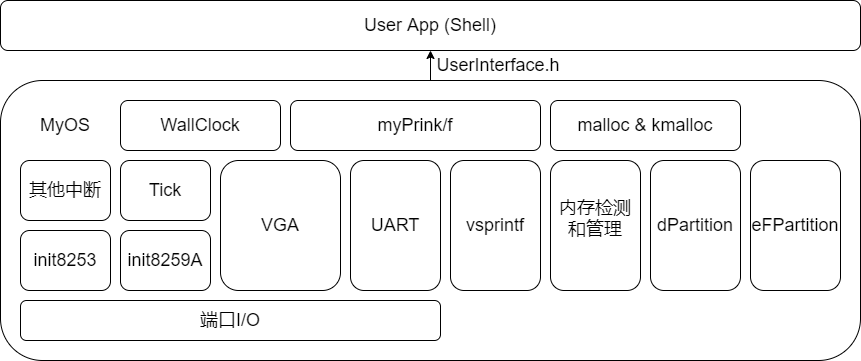

  概述：

  1. 最底层为端口I/O，通过内嵌汇编完成，实现对硬件端口的输入输出。

  2. 基于端口I/0实现VGA输出程序、UART输出程序、i8259和i8253初始化程序。

     内存检测程序memTest，等大小内存分区管理算法eFPartition，动态大小内存分区管理算法dPartition，内存管理程序pMemInit。

  3. 基于已经初始化的i8259、i8253，实现时钟中断Tick和其他中断（统一认为是unknown interrupt，忽略）的处理；
  
     基于VGA输出、UART串口输出和格式化字符串处理程序vsprintf，实现myPrintk和myPrintf;

     基于Tick和VGA输出，实现wallClock墙钟；

     基于上一层实现的内存相关管理程序，封装malloc/free与kmalloc/kfree接口。

  4. 用户模块userApp，MyOS通过userInterface.h向其提供接口，基于这些接口实现shell功能。本次新增了命令的动态注册和内存管理相关程序的测试用例。
<br>
- **主流程及其实现**

  系统启动和运行的主流程如下：

  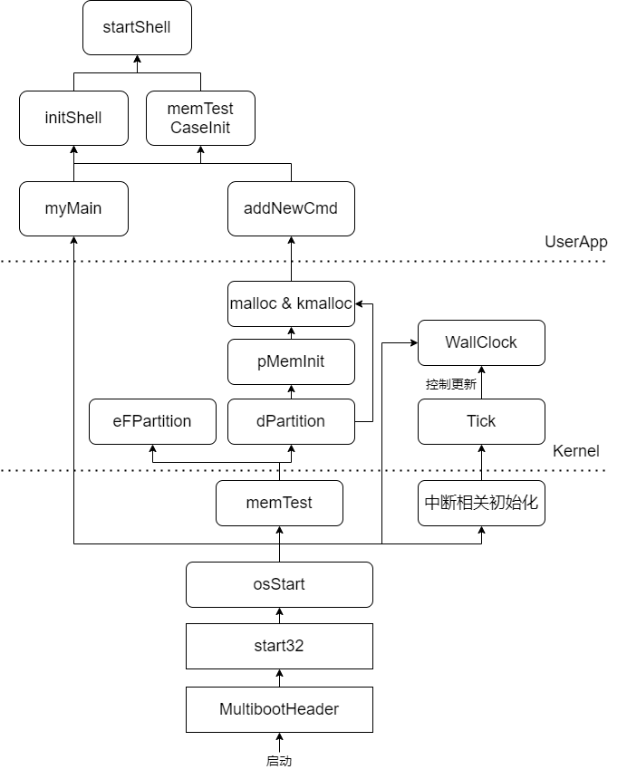

  1. 从multibootHeader.s开始，验证multiboot header，开始引导系统。

  2. 跳转至start32.s，通过汇编，构建堆栈，初始化bss段，初始化中断描述符表idt。

  3. 跳转至osStart.c，开始运行myOS，初始化i8259和i8253，开中断，从而实现时钟中断Tick。

     osStart.c初始化墙钟，墙钟的更新由Tick维护，墙钟和Tick都是Kernel的一部分。

     osStart.c进行内存检测memTest，之后基于dPartition进行内存初始化pMemInit，在初始化后的内存之上再次通过dPartition分离出用户内存uMem和内核内存kMem两块内存，在此起初上封装出malloc与kmalloc。

     osStart.c运行用户程序myMain。

  4. 用户程序myMain初始化shell，添加相应命令；初始化内存管理算法的测试用例，添加相应命令（添加命令通过malloc实现）。初始化全部结束后，启动shell。

## 主要功能模块及其实现

  本次实验4，是在我自己的实验3代码基础上完成的，过程中参考了助教提供的框架代码。

  - **内存检测算法**

    实现内存分区管理算法前，需要先检测可用内存的范围，可用内存指“可以正常读写”的内存。

    我们认为内存从1M开始，后面只有一整块的连续内存。则内存检测的算法如下（以下内存读写都通过指针实现）：

    1. 从内存的某一处（记作`start`，以字节为单位，不低于1M即`0x100000`）开始检测，以`grainSize`（以字节为单位，不小于2）为检测步长。

    2. 读出`grainSize`的前两个字节，记作`data`。

    3. 向这两个字节覆盖写入`0xAA55`，再读出，判断是否仍为`0xAA55`，若不是，则标记为不可用内存。

    4. 向这两个字节覆盖写入`0x55AA`，再读出，判断是否仍为`0x55AA`，若不是，则标记为不可用内存。

    5. 将`data`写回这两个字节。若前两步检测出了不可以内存，则检测结束。
    
    6. 检测`grainSize`末尾的两个字节，重复2-5步。

    7. 检测下一个`grainSize`，重复2-6步，直到检测结束。

    代码如下：

    ```C
    // test the pMem
    void memTest(unsigned long start, unsigned long grainSize) {

        if (start < 0x100000)
            start = 0x100000;
        if (grainSize < 2)
            grainSize = 2;

        unsigned long addr = start;
        unsigned short data;
        unsigned short *addr_head, *addr_tail;
        unsigned short test_data1 = 0xAA55;
        unsigned short test_data2 = 0x55AA;
        int flag_fail = 0; // whether the test fails
        pMemSize = 0;
        pMemStart = start;

        // get the size of pMem
        while (!flag_fail) {
            flag_fail = 0;

            addr_head = (unsigned short *)addr; // the first 2 bytes
            addr_tail = (unsigned short *)(addr + grainSize - 2); // the last 2 bytes

            data = *addr_head; // read original data
            *addr_head = test_data1; // write 0xAA55
            if (*addr_head != test_data1)
                flag_fail = 1;
            *addr_head = test_data2; // write 0x55AA
            if (*addr_head != test_data2)
                flag_fail = 1;
            *addr_head = data; // write back original data

            data = *addr_tail; // read original data
            *addr_tail = test_data1; // write 0xAA55
            if (*addr_tail != test_data1)
                flag_fail = 1;
            *addr_tail = test_data2; // write 0x55AA
            if (*addr_tail != test_data2)
                flag_fail = 1;
            *addr_tail = data; // write back original data
            
            if (!flag_fail) {
                addr += grainSize;
                pMemSize += grainSize;
            }
        }
      
        myPrintk(0x7, "MemStart: %x\n", pMemStart);
        myPrintk(0x7, "MemSize:  %x\n", pMemSize);
    }
    ```

  - **等大小内存分区管理**
<br>
    - **相关数据结构的定义**

      等大小内存分区管理算法的基本思路是将内存块划分为等大的多个小块，分配和回收时，直接以这些小块为单位。
      
      为提高管理效率，我们用一个数据结构`EEB`来管理每一个小块，再用一个特定的数据结构`eFPartition`来管理整个分区，记录必要的信息。

      为节约内存空间，我们将这些数据结构直接存储在空闲内存块本身。`eFPartition`存储在整个分区的头部，而`EEB`则存储在每个小块的头部，如图所示：

      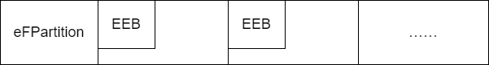

      这种存储方式引出了一个问题：将内存块分配给用户时，是否能将这些头部信息覆盖掉？我们将在下面详细讨论。
<br>
      - **句柄数据结构 eFPartition**

        ```C
        // the handler of a eFparted-memory
        typedef struct eFPartition {
            unsigned long totalN;
            unsigned long perSize;	
            unsigned long firstFree;
        } eFPartition;
        ```

        数据结构中，`totalN`表示划分出的等大小块的数量，`perSize`表示每个小块的大小，`firstFree`为第一个空闲块的起始地址。

        当分配时，直接分配`firstFree`指向的内存块，然后修改`firstFree`为下一个内存块的地址，这个地址可以直接通过与`perSize`相加计算出来。

        回收时，接口提供的是一个地址，需要free掉这个地址之前的所有块。可以从eFPartition后的第一个块出发，以`perSize`为步长，逐个进行回收。

        显然，`eFPartition`存储的数据是需要保护的。分配内存时，不能让用户对其中数据进行修改，因为回收时我们需要利用这些数据。
<br>
      - **等大小内存块管理数据结构 EEB**

        ```C
        // a free eFparted-memory block
        typedef struct EEB {
            unsigned long nextStart;
        } EEB;
        ```

        `nextStart`为下一个相邻块的起始地址，便于我们对所有块的遍历。此数据是不需要被保护的，因为回收时我们并不依赖于此数据。事实上，回收时，我们会写入新的`nextStart`。
<br>
    - **等大小内存分区初始化 eFPartitionInit**

      初始化，即把一块内存划分为多个小块，建立整个分区的句柄`eFPartition`和每个小块的头部`EEB`。

      初始化时，用户传入每个小块的大小`perSize`和需要划分的数量`n`。为便于管理，我们将`perSize`按照`EEB`的大小，即4字节对齐：

      ```C
      // align a value by 4 bytes
      unsigned long align4(unsigned long value) {
          if (value & 1) value += 1;
          if (value & 2) value += 2;
          return value;
      }
      ```

      ```C
      unsigned long perSizeAlign = align4(perSize);
      ```

      然后即可建立句柄，记录相关的信息，再以对齐过的`perSizeAlign`为步长，划分各小块。

      ```C
      eFPartition *handler = (eFPartition *)start;
      handler->perSize = perSizeAlign;
      handler->totalN = n;
      unsigned long addr = start + sizeof(eFPartition);
      handler->firstFree = addr;

      // divide this entire memory block into equal-sized blocks
      EEB *block;
      for (int i = 0; i < n; i++) {
          block = (EEB *)addr; // store the data structure in free memory
          addr += perSizeAlign;
          block->nextStart = addr;
      }
      block->nextStart = 0;
      ```

      值得注意的是，由于句柄的存在，整个分区的实际大小为：（当然，用户在正常使用时，对此大小是一无所知的）

      ```C
      perSizeAlign * n + sizeof(eFPartition);
      ```

      最后将句柄的地址返回，作为这块分区的标志和分配回收时的依据：

      ```C
      return start;
      ```

    - **等大小内存块分配 eFPartitionAlloc**

      分配句柄记录的第一个空闲块即可，返回其起始地址。如果没有空闲块（句柄`firstFree`为0），则返回0，标志异常。

      ```C
      unsigned long eFPartitionAlloc(unsigned long EFPHandler) {
          eFPartition *handler = (eFPartition *)EFPHandler;

          // no free block to alloc
          if (!handler->firstFree)
              return 0;

          EEB *block = (EEB *)handler->firstFree;
          handler->firstFree = block->nextStart;

          // return the start of alloced memory
          return (unsigned long)block;
      }
      ```

    - **等大小内存块回收 eFPartitionFree**

      传入一个地址`mbStart`和句柄，回收`mbStart`对应的内存块。

      需要先判断`mbStart`的范围是否合法，即是否在句柄所管理的范围之内，不合法则返回0：

      ```C
      // illegal mbStart
      if (mbStart < EFPHandler + sizeof(eFPartition))
          return 0;

      eFPartition *handler = (eFPartition *)EFPHandler;

      // illegal mbStart
      if (mbStart > EFPHandler + eFPartitionTotalSize(handler->perSize, handler->totalN))
          return 0;;
      ```

      如果合法，即可开始回收。考虑到用户的回收顺序是自由的，因此整个分区的内存块使用情况有可能呈现比较混乱的局面。需要先尝试寻找`mbStart`之前和之后距离最近的空闲块。

      ```C
      unsigned long addr = handler->firstFree;
      unsigned long addrPre = 0;
      unsigned long addrNext = 0;
      EEB *block;

      // find the closest pre and next free blocks of start
      while (addr) {
          block = (EEB *)addr;
          if (addr < mbStart)
              addrPre = addr;
          else if (addr > mbStart) {
              addrNext = addr;
              break;
          }
          addr = block->nextStart;
      }
      ```

      接下来进行回收。
      
      若`mbStart`之后存在空闲块，则让`mbStart`块的`nextStart`指向这个空闲块；否则将`nextStart`的值设置为0，即`mbStart`对应块是全分区最后一个空闲块。

      若`mbStart`之前存在空闲块，则让此空闲块的`nextStart`指向这个`mbStart`块；否则让句柄的`firstFree`指向`mbStart`块，即`mbStart`对应块是全分区第一个空闲块。

      ```C
      // free
      block = (EEB *)mbStart;
      if (addrNext)  // if the next free block is found
          block->nextStart = addrNext;
      else // no free blocks behind start
          block->nextStart = 0;

      if (addrPre) { // if the pre free block is found
          EEB *blockPre = (EEB *)addrPre;
          blockPre->nextStart = mbStart;
      }
      else // no free blocks before start
          handler->firstFree = mbStart;
      ```

      回收完毕后，函数返回1表示回收正常。
<br>
  - **动态大小内存分区管理**
<br>
    - **相关数据结构定义**

      类似等大小内存分区管理算法，动态大小管理算法也需要句柄数据结构`dPartition`和划分的内存块数据结构`EMB`。它们的存储也是与大小内存分区管理算法类似。
<br>
      - **句柄数据结构 dPartition**

        ```C
        // the handler of a dParted-memory
        typedef struct dPartition {
            unsigned long size;
            unsigned long firstFree; 
        } dPartition;
        ```

        数据结构中，`size`整个分区的大小，`firstFree`为第一个空闲块的起始地址。

        初始化时，用户传入分区大小，我们在其上建立句柄数据结构，然后将剩余空间划分为一个内存块，用一个`EMB`管理。

        用户请求分配时，从这个内存块划分出大小合适的一块。随着分配的进行，分区内部逐渐碎片化。

        回收时，需要考虑回收的块能否与前后相邻的空闲空间合并。
<br>
      - **动态大小内存块管理数据结构 EMB**

        ```C
        // a block of dParted-memory
        typedef struct EMB {
            unsigned long size; // need to be protected when alloc EMB
            union {
                unsigned long nextStart;    // if free, pointer to next block
                unsigned long userData;		// if allocated, belongs to user
            };	                           
        } EMB;
        ```

        `size`为此块的大小，`nextStart`为下一个空闲块的地址。

        不同于`EEB`，`EMB`的`size`需要被保护。因为每一个块的大小都是不定的，不可能像等大小算法那样统一保存在句柄中。我们需要保护`size`作为回收的依据。`nextStart`则不需要保护，它在回收时可以根据已有信息重建。
        
        这样，分配时，分配给用户的内存的起始地址实际上是`EMB`的地址加上`sizeof(unsigned long)`，块的实际大小也是用户请求的大小加上`sizeof(unsigned long)`。当然，这些信息对用户都是不可见的，用户只知道自己请求出的大小。
<br>
    - **动态大小内存分区初始化 dPartitionInit**

      传入一块内存分区的起始地址，以及这块分区的大小，将其初始化为动态大小内存分区。即在其上建立句柄`dPartition`，再将剩余空间划分为一个内存块用`EMB`管理。

      ```C
      unsigned long dPartitionInit(unsigned long start, unsigned long totalSize) {
          if (totalSize <= sizeof(dPartition) + sizeof(EMB)) // total size too small
              return 0;

          dPartition *handler = (dPartition *)start;
          handler->size = totalSize;
          handler->firstFree = start + sizeof(dPartition);

          // create a block list node for this entire momory
          EMB *block = (EMB *)handler->firstFree;
          block->size = totalSize - sizeof(dPartition);
          block->nextStart = 0;

          return start;
      }
      ```

    - **动态大小内存分配 dPartitionAlloc**

      传入句柄和所需的大小，用first fit算法在句柄管理的所有内存块里寻找大小合适的内存块进行分配。

      ```C
      // alloc a memory block with specific size
      unsigned long dPartitionAlloc(unsigned long dpHandler, unsigned long size) {
          return dPartitionAllocFirstFit(dpHandler, size);
      }
      ```

      `dPartitionAllocFirstFit`的实现：

      首先，将用户请求的大小按8字节对齐，为`sizeAlign`。然后需要注意的是，如上面所述，需要保护`EMB`的`size`域不被用户改变，所以实际分配的内存块大小应为

      ```C
      sizeAlign + sizeof(unsigned long)
      ```

      相应地，分配给用户的内存地址也不是`EMB`块的起始地址，而是要加上`sizeof(unsigned long)`。

      之后，用first fit算法，从句柄管理的第一个空闲块开始，寻找合适的内存块。有三种情况：

      1. 内存块大小大于等于`sizeAlign + sizeof(unsigned long)`，小于等于`sizeAlign + sizeof(unsigned long) + sizeof(EMB)`，即大小足够，但剩余大小至多只能容纳一个`EMB`。这种情况，直接将此块分配，而不做分割，因为分割出的块过于小，是无意义的。

      ```C
      if (block->size >= sizeAlign + sizeof(unsigned long) && 
          block->size <= sizeAlign + sizeof(unsigned long) + sizeof(EMB)) {
          // directly alloc this block
          if (addrPre == 0) // this block is the first free block of dpHandler
              handler->firstFree = block->nextStart;
          else
              blockPre->nextStart = block->nextStart;

          return addr + sizeof(unsigned long); // user can't change "size" field of EMB
      }
      ```

      2. 内存块大小大于`sizeAlign + sizeof(unsigned long) + sizeof(EMB)`，则分配出`sizeAlign + sizeof(unsigned long)`大小的块，剩余部分划分为一个新的`EMB`块。

      ```C
      else if (block->size > sizeAlign + sizeof(unsigned long) + sizeof(EMB)) {
          // split this block into two
          unsigned long addrNewNode = addr + sizeof(unsigned long) + sizeAlign;
          EMB *blockNew = (EMB *)(addrNewNode);
          blockNew->size = block->size - sizeAlign - sizeof(unsigned long);
          blockNew->nextStart = block->nextStart;
          block->size -= blockNew->size;
        
          if (addrPre == 0) // this block is the first free block of dpHandler
              handler->firstFree = addrNewNode;
          else
              blockPre->nextStart = addrNewNode;

          return addr + sizeof(unsigned long); // user can't change "size" field of EMB
      }
      ```

      3. 内存块大小小于`sizeAlign + sizeof(unsigned long)`，不够分配，不做任何操作，根据此块的`nextStart`信息，跳转到下一个空闲内存块进行考察。

      如果没有找到任何合适的块，即没有进行分配，则返回`0`表示异常。
<br>
    - **动态大小内存回收 dPartitionFree**

      传入句柄和需要回收的内存的起始地址，对该内存进行free。

      上面提到，分配时返回给用户的`start`实际上是`EMB`块的起始地址加上`sizeof(unsigned long)`。相应地，此函数中用户传入的`start`也不是`EMB`块的起始地址，因此需要先做如下处理：

      ```C
      start -= sizeof(unsigned long);
      ```

      如果`start`范围合法，在句柄所管理的范围内，寻找`start`对应的内存块前、后最近的空闲块（可以不存在）：

      ```C
      // find the closest pre and next free blocks of start
      while (addr) {
          block = (EMB *)addr;
          if (addr < start)
              addrPre = addr;
          else if (addr > start) {
              addrNext = addr;
              break;
          }
          addr = block->nextStart;
      }
      ```

      然后进行释放，记被释放的块为`block`。

      ```C
      block = (EMB *)start;
      ```
      
      先考虑释放后的向后合并，如果`block`后存在空闲块`blockNext`，且与`block`相邻，则合并；不相邻则不合并，让`block`的`nextStart`指向`blockNext`；若`block`后不存在空闲块，则`block`为全分区的最后一个空闲块，让`block`块的`nextStart`为0。

      注意，由于`block`的`size`域已被我们保护，所以可用于相邻的判断。

      ```C
      if (addrNext) { // if the next free block is found
          if (addrNext == start + block->size) { // adjacent, merge to next
              EMB *blockNext = (EMB *)addrNext;
              block->size += blockNext->size;
              block->nextStart = blockNext->nextStart;
          }
          else // not adjacent, dont't merge
              block->nextStart = addrNext;
      }
      else // no free blocks behind start
          block->nextStart = 0;
      ```

      再考虑向前合并，如果`block`前存在空闲块`blockPre`，且与`block`相邻，则合并；不相邻则不合并，让`blockPre`的`nextStart`指向`block`；若`block`前不存在空闲块，则`block`为全分区的第一个空闲块，让句柄的`firstFree`指向`block`。

      ```C
      if (addrPre) { // if the pre free block is found
          EMB *blockPre = (EMB *)addrPre;
          if (start == addrPre + blockPre->size) { // adjacent, merge to pre
              blockPre->size += block->size;
              blockPre->nextStart = block->nextStart;
          }
          else // not adjacent, dont't merge
              blockPre->nextStart = start;
      }
      else // no free blocks before start
          handler->firstFree = start;
      ```

      至此完成了回收。
<br>
  - **可用内存管理与malloc和kmalloc**
<br>
    - **可用内存管理**

      我们通过`memTest`检测出了可正常读写的内存。检测是从1M开始的，包含了我们的OS代码部分。真正使用时，需要排除这一部分，也就是从`_end`的地址开始：

      ```C
      unsigned long _end_addr = (unsigned long) &_end;
      memTest(0x100000, 0x1000);
      myPrintk(0x7, "_end:     %x\n", _end_addr);
      if (pMemStart <= _end_addr) {
          pMemSize -= _end_addr - pMemStart;
          pMemStart = _end_addr;
      }
      ```

      之后，利用已经实现的`dPartitionInit`，将整个可用内存pMem初始化得到句柄：

      ```C
      pMemHandler = dPartitionInit(pMemStart, pMemSize);
      ```

      在此基础上，用`dPartitionAlloc`分配出两块较大的内存，并用`dPartitionInit`初始化，得到句柄，作为用户内存和内核内存：

      ```C
      kMemStart = dPartitionAlloc(pMemHandler, pMemSize / 3);
      uMemStart = dPartitionAlloc(pMemHandler, pMemSize / 3);

      kMemHandler = dPartitionInit(kMemStart, pMemSize / 3);
      uMemHandler = dPartitionInit(uMemStart, pMemSize / 3);
      ```

      这两个句柄将被我们用于实现`malloc`和`kmalloc`。
    <br>
    - **malloc** 

      如下所示，在用户内存句柄`uMemHandler`管理的内存上使用`dPartitionAlloc`和`dPartitionFree`。将它们封装成`malloc`和`free`。

      ```C
      // malloc for user
      unsigned long malloc(unsigned long size) {
          return dPartitionAlloc(uMemHandler, size);
      }

      // free for user
      unsigned long free(unsigned long start) {
          return dPartitionFree(uMemHandler, start);
      }
      ```

    - **kmalloc**

      如下所示，在内核内存句柄`kMemHandler`管理的内存上使用`dPartitionAlloc`和`dPartitionFree`。将它们封装成`kmalloc`和`kfree`。

      ```C
      // kmalloc for kernel, seperate from malloc
      unsigned long kmalloc(unsigned long size) {
          return dPartitionAlloc(kMemHandler, size);
      }

      // kfree for kernel, seperate from free
      unsigned long kfree(unsigned long start) {
          return dPartitionFree(kMemHandler, start);
      }
      ```

      而`kMemHandler`与`uMemHandler`管理的内存本身就是分离开的，因此也就实现了`malloc`和`kmalloc`的隔离。 
    <br>
    - **kmalloc测试用例**

      实验要求自己编写`kmalloc`的测试用例，我仿照了框架中已给出的`malloc`测试用例。
<br>
      - **maxKmallocSizeNow**

        此命令用于显示当前时刻`kmalloc`可分配的最大空间。
        
        测试时的具体用法可以为：先使用一次此命令，查看`MAX_KMALLOC_SIZE`，再使用`testKmalloc`（见下文）测试kmalloc的分配和回收，然后再使用一次`maxKmallocSizeNow`，查看`MAX_KMALLOC_SIZE`是否与调用`testKmalloc`前相同，若相同则代表`kfree`回收正常。

        此命令的实现是以`0x1000`为步长，从0开始逐次增大请求大小，不断地`kmalloc`请求空间，若成功则`kfreee`，否则结束检查，即找到了最大值。

        ```C
        int maxKmallocSizeNow(int argc, unsigned char **argv) {
            int i = 0x1000;
            unsigned long x;

            while(1) {
                x = kmalloc(i);
                if(x) kfree(x);	
                else break;

                i += 0x1000;
            }
            myPrintf(0x7, "MAX_KMALLOC_SIZE: 0x%x (with step = 0x1000);\n",i);	
        }
        ```

      - **testKmalloc**

        此命令测试`kmalloc`的分配和回收。用`kmalloc`请求分配两个内存块，大小分别为`17`和`23`字节，前者填充15个`'$'`以及换行符和`'\0'`，后者填充21个`'&'`以及换行符和`'\0'`，再打印这两个分区的内容，用户自行检查输出情况是否符合预期。然后用`kfree`回收这两个分区。

        ```C
        int testKmalloc(int argc, unsigned char **argv) {
            char *buf1 = (char *)kmalloc(17);
            char *buf2 = (char *)kmalloc(23);

            for(int i = 0; i < 15; i++) *(buf1 + i) = '$';
            *(buf1 + 15) = '\n';
            *(buf1 + 16) = '\000';

            for(int i = 0; i < 21; i++) *(buf2 + i) = '&';
            *(buf2 + 21) = '\n';
            *(buf2 + 22) = '\000';

            myPrintf(0x5, "We allocated 2 buffers.\n");
            myPrintf(0x5, "BUF1(size=15, addr=0x%x) filled with 15($): ", (unsigned long)buf1);
            myPrintf(0x7,buf1);
            myPrintf(0x5, "BUF2(size=21, addr=0x%x) filled with 21(&): ", (unsigned long)buf2);
            myPrintf(0x7,buf2);

            kfree((unsigned long)buf1);
            kfree((unsigned long)buf2);

            return 0;
        }
        ```

      - **testKUmallocSep**

        此命令用于测试`kmalloc`和`malloc`的彼此隔离。

        此命令是分别用`malloc`和`kmalloc`请求两个分区，大小都为`12`，前者填充10个`'*'`以及换行符和`'\0'`，后者填充10个`'#'`以及换行符和`'\0'`，再打印这两个分区的内容，用户自行检查输出情况是否符合预期。然后用`kfree`和`free`回收这两个分区。

        调用此命令前后，可以调用`maxKmallocSizeNow`和`maxMallocSizeNow`检查各自的最大分配大小是否保持前后一致，以验证隔离和各自`free`的正确性。

        ```C
        int testKUmallocSep(int argc, unsigned char **argv) {
            char *buf1 = (char *)malloc(12);
            char *buf2 = (char *)kmalloc(12);

            for(int i = 0; i < 10; i++) *(buf1 + i) = '*';
            *(buf1 + 10) = '\n';
            *(buf1 + 11) = '\000';

            for(int i = 0; i < 10; i++) *(buf2 + i) = '#';
            *(buf2 + 10) = '\n';
            *(buf2 + 11) = '\000';

            myPrintf(0x5, "We malloc 1 buffer through malloc, 1 buffer through kmalloc\n");
            myPrintf(0x5, "MALLOC BUF1(size=10, addr=0x%x) filled with 10(*): ", (unsigned long)buf1);
            myPrintf(0x7, buf1);
            myPrintf(0x5, "KMALLOC BUF2(size=10, addr=0x%x) filled with 10(#): ", (unsigned long)buf2);
            myPrintf(0x7, buf2);

            free((unsigned long)buf1);
            kfree((unsigned long)buf2);

            return 0;
        }
        ```
        
  - **Shell动态注册命令**
    
    命令改用链表存储。新命令用封装好的`malloc`来动态注册，头插法插入命令链表。这部分代码很简单，不多做讲解。

    ```C
    // the data structure for shell command
    typedef struct _command {
        unsigned char *cmd;
        int (*func)(int argc, unsigned char **argv);
        void (*help_func)(void);
        unsigned char *desc;
        struct _command *next;
    } command;
    ```

    ```C
    command *cmds = NULL; // command list
    ```

    ```C
    // add a new command to cmd list, using malloc to implement
    void addNewCmd(unsigned char *cmd, 
        int (*func)(int argc, unsigned char **argv), 
        void (*help_func)(void), 
        unsigned char* desc) {
        
        command *newCmd = (command *)malloc(sizeof(command));
        char *cmd_new = (char *)malloc(myStrlen(cmd) + 1);
        char *desc_new = (char *)malloc(myStrlen(desc) + 1);
        if (!newCmd || !cmd_new || !desc_new) // malloc failed
            return;

        newCmd->cmd = cmd_new;
        newCmd->desc = desc_new;
        newCmd->func = func;
        newCmd->help_func = help_func;
        myStrcpy(newCmd->cmd, cmd);
        myStrcpy(newCmd->desc, desc);

        // insert to the head of list
        newCmd->next = cmds;
        cmds = newCmd;
    }
    ```

## 源代码说明

  - **目录组织**

    ```java
    src
    ├── multibootheader
    │   └── multibootHeader.S // mutlibootheader
    ├── myOS
    │   ├── dev
    │   │   ├── i8253.c // i8253初始化模块
    │   │   ├── i8259A.c // i8259初始化模块
    │   │   ├── uart.c // uart输出模块
    │   │   └── vga.c // vga输出模块
    │   ├── i386
    │   │   ├── io.c // 端口io模块
    │   │   ├── irq.S // 中断处理相关汇编代码
    │   │   ├── irqs.c // 中断处理相关C代码
    │   ├── include // 各头文件
    │   │   ├── interrupt.h
    │   │   ├── io.h
    │   │   ├── kmalloc.h
    │   │   ├── malloc.h
    │   │   ├── mem.h
    │   │   ├── myPrintk.h
    │   │   ├── string.h
    │   │   ├── tick.h
    │   │   ├── uart.h
    │   │   ├── vga.h
    │   │   ├── vsprintf.h
    │   │   └── wallClock.h
    │   ├── kernel
    │   │   ├── mem // 内存相关
    │   │   │   ├── dPartition.c // 动态内存分区管理算法
    │   │   │   ├── eFPartition.c // 等大小内存分区管理算法
    │   │   │   ├── malloc.c // malloc和kmalloc实现
    │   │   │   └── pMemInit.c // 内存检测和用户、内核分区初始化
    │   │   ├── tick.c // tick模块
    │   │   └── wallClock.c // 墙钟模块
    │   ├── lib // 自编或移植的库函数
    │   │   ├── string.c
    │   │   └── vsprintf.c
    │   ├── osStart.c // 系统启动过程的C代码
    │   ├── printk
    │   │   └── myPrintk.c // myPrintk/f模块
    │   └── start32.S // 系统启动过程的汇编代码
    │   └── userInterface.h // OS提供给用户程序的接口
    └── userApp
        ├── main.c // 用户程序入口
        ├── memTestCase.c // 内存管理算法测试用例
        ├── memTestCase.h
        ├── shell.c // shell模块
        └── shell.h
    ```

  - **Makefile组织**

    ```
    src
    ├── myOS
    │   ├── dev
    │   ├── i386
    │   ├── kernel
    │   │   └── mem
    │   ├── lib
    │   └── printk
    └── userApp
    ```  

## 代码布局（地址空间）说明

本次的代码布局（地址空间）与实验二相同：

| Offset | field      |  Note | 
| ------------------- | ----------------- | -----|
| 1M                   | .text              | 代码段   |
| ALIGN(16)           | .data              | 数据段   |
| ALIGN(16)           | .bss             | bss段   |
| ALIGN(16)           |               | _end 空闲内存起始地址 |

ALIGN(16)表示起始地址按16字节对齐。


## 编译过程说明

主要Makefile文件：

```makefile
SRC_RT = $(shell pwd)

CROSS_COMPILE=
ASM_FLAGS = -m32 --pipe -Wall -fasm -g -O1 -fno-stack-protector	
C_FLAGS = -m32 -fno-stack-protector -fno-builtin -g
INCLUDE_PATH = myOS/include

.PHONY: all
all: output/myOS.elf

MULTI_BOOT_HEADER = output/multibootheader/multibootHeader.o
include $(SRC_RT)/myOS/Makefile
include $(SRC_RT)/userApp/Makefile

OS_OBJS = ${MYOS_OBJS} ${USER_APP_OBJS}

output/myOS.elf: ${OS_OBJS} ${MULTI_BOOT_HEADER}
	${CROSS_COMPILE}ld -n -T myOS/myOS.ld ${MULTI_BOOT_HEADER} ${OS_OBJS} -o output/myOS.elf

output/%.o : %.S
	@mkdir -p $(dir $@)
	@${CROSS_COMPILE}gcc ${ASM_FLAGS} -c -o $@ $<

output/%.o : %.c
	@mkdir -p $(dir $@)
	@${CROSS_COMPILE}gcc ${C_FLAGS} -I${INCLUDE_PATH} -c -o $@ $<

clean:
	rm -rf output
```

编译过程分为两步：

1. 编译各个汇编.S源文件与c语言.c源文件，生成.o文件。这一步需要包括各目录下的Makefile文件。

2. 将各.o文件进行链接，生成可执行的myOS.elf文件。

## 运行和运行结果说明

- **运行过程**

  打开源码所在目录，通过编写好的脚本一键编译与运行：

  ```sh
  ./source2img.sh
  ```

  接下来键入命令（x为`0`、`1`等，视具体情况而定）：

  ```sh
  sudo screen /dev/pts/x
  ```

  即可进入交互界面，通过重定向的串口与qemu交互。  
  <br>

- **运行结果说明**
  <br>
  - **系统启动和可用内存测试**

    本次新加入了OS在启动前等待串口就绪的功能。即要执行`sudo screen /dev/pts/x`后，在串口输入任意按键，才能启动OS。

    运行结果如下，功能正常：

    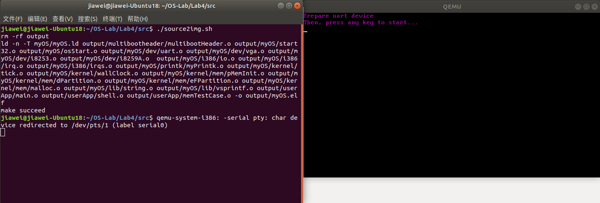

    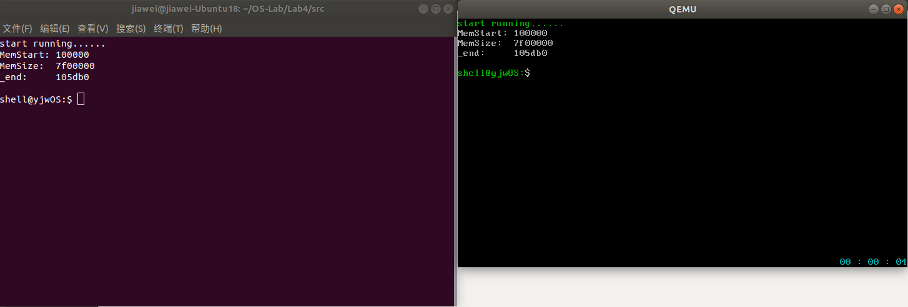

    第二张图同时显示了内存测试的结果，可以看到功能正常。

  - **命令动态注册测试**

    用cmd列出全部命令，并尝试执行，测试命令的动态注册是否正确：

    如下，预期的命令都已注册，cmd功能正常，动态注册成功。

    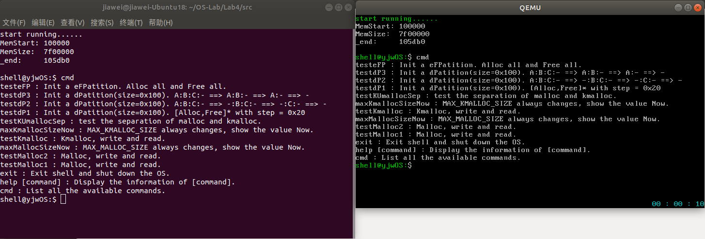

  - **malloc测试**

    通过命令`testMalloc1`、`testMalloc2`和`maxMallocSizeNow`实现。

    用`malloc`请求大小不定的内存块，填充为特定字符并输出，检查分配是否正常。如图所示，输出符合预期，功能正常。

    在`testMalloc1`、`testMalloc2`前后调用`maxMallocSizeNow`检查`malloc`最大可分配范围是否保持一致，以检查`free`是否正常。如图所示，最大范围始终保持`0x2A54000`，回收正常。

    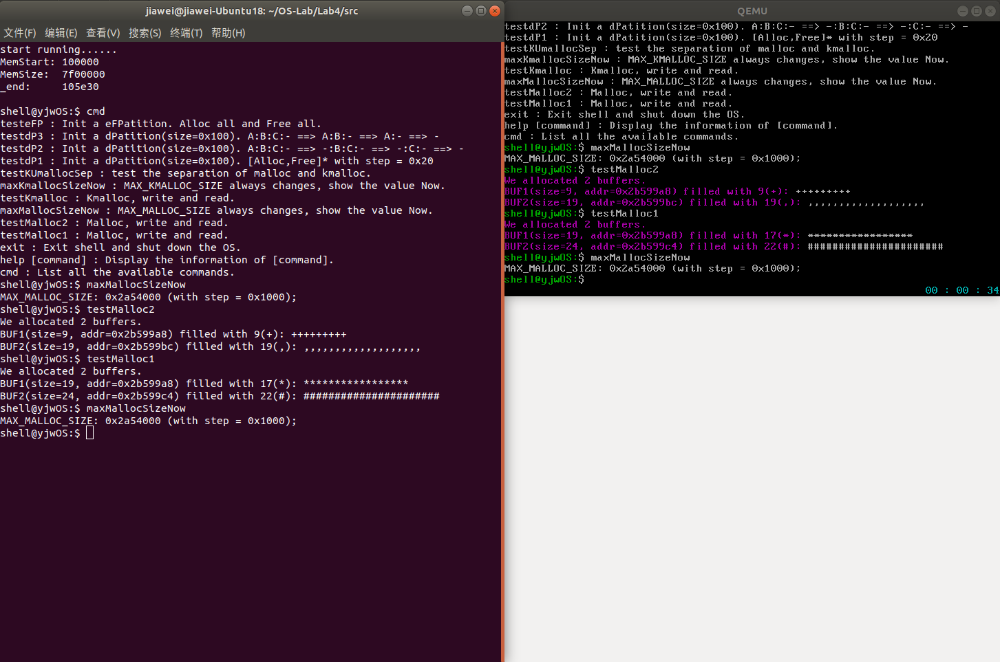

  - **kmalloc测试**

    通过命令`testKmalloc`、`testKUmallocSep`、`maxKmallocSizeNow`和`maxMallocSizeNow`实现。

    `testKmalloc`：用`kmalloc`请求大小不定的内存块，填充为特定字符并输出，检查分配是否正常。如图所示，输出符合预期，功能正常。

    `testKUmallocSep`：分别用`malloc`和`kmalloc`请求大小不定的内存块，填充为特定字符并输出，检查两套接口的隔离是否正常。如图所示，输出符合预期，隔离正常。

    在`testKmalloc`、`testKUmallocSep`前后调用`maxMallocSizeNow`与`maxKmallocSizeNow`检查`malloc`和`kmalloc`最大可分配范围是否保持一致，以检查`free`和`kfree`是否正常，以及隔离是否正常。如图所示，二者的最大范围各自分别保持`0x2A54000`，功能正常。

    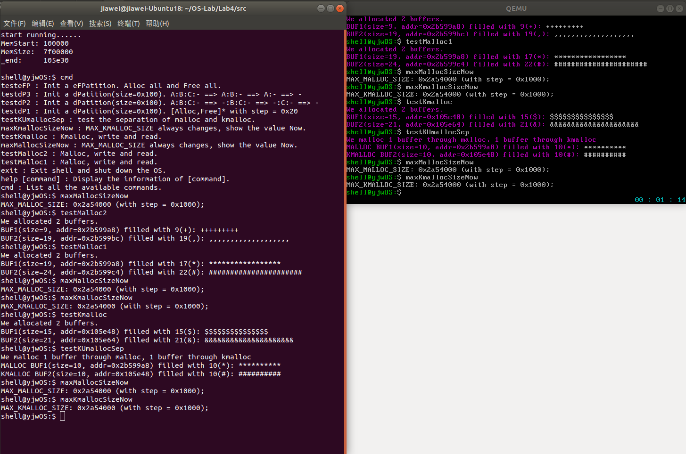

  - **eFPartition测试**

    通过命令`testeFP`检查。
    
    先`malloc`请求一块`0x8c`大小的内存块，用`eFPartitionInit`初始化为合适大小，划分为4个块。之后用`eFPartitionAlloc`请求分配五次，前四次A、B、C、D都成功，最后一次E失败，符合预期。然后分别释放A、B、C、D块，可以看到回收正常。这样就测试了所有`eFPartition`的功能。

    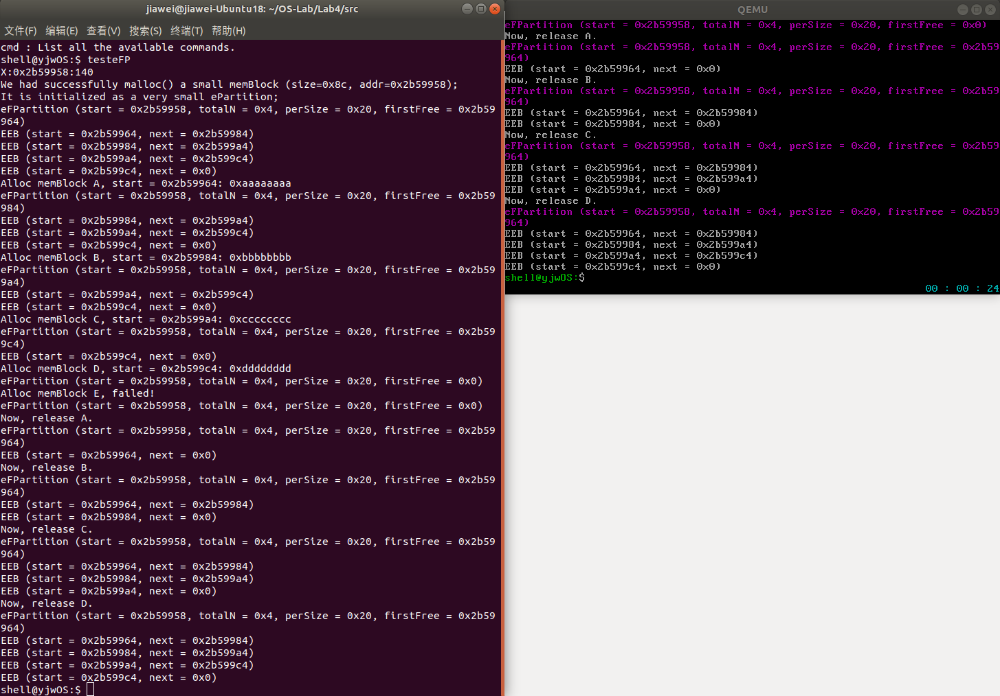

  - **dPartition测试**

    通过命令`testdP1`、`testdP2`、`testdP3`检查。

    以`testdP2`为例，先`malloc`请求一块`0x100`大小的内存块，用`dPartitionInit`初始化，之后用`eFPartitionAlloc`请求分配三次，大小分别为`0x10`、`0x20`、`0x30`，全部都成功，功能符合预期。然后依次释放A、B、C，可以看到回收正常、空闲块合并正常。这样就测试了`dPartition`的功能。

    `testdP1`和`testdP3`与此类似，其中`testdP1`还测试了分配失败的情况，这里不做详细说明。

    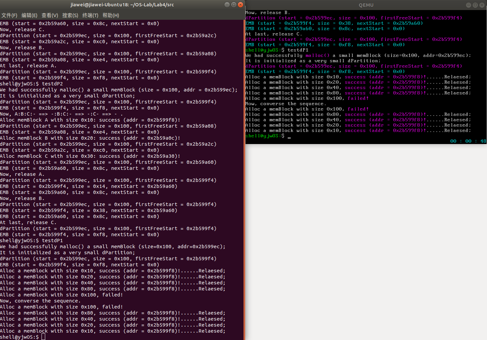

    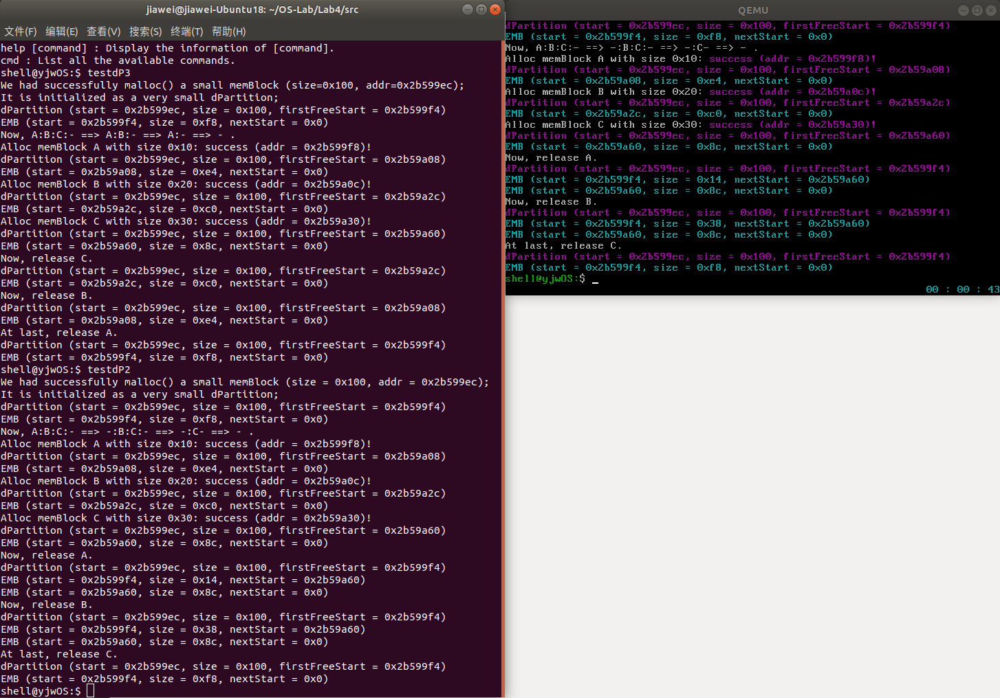

    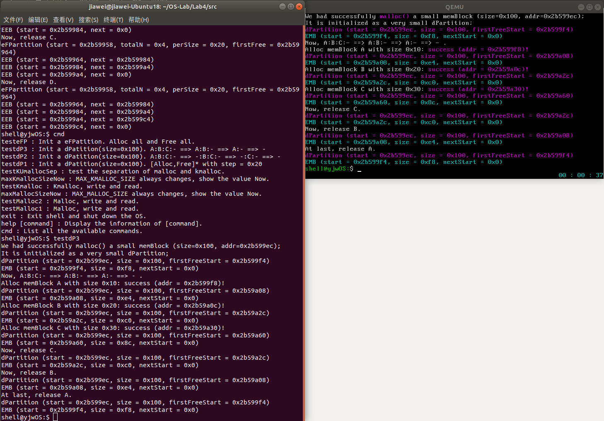

## 遇到的问题和解决方案

- 源码中未发现任何语法错误，但编译时仍提示`conflicting types for build-in function 'free'`警告。

  这个警告出现的原因是`free`函数的函数名与C的库函数函数名相同。解决办法是在Makefile的C编译选项中加上`-fno-builtin`参数即可。