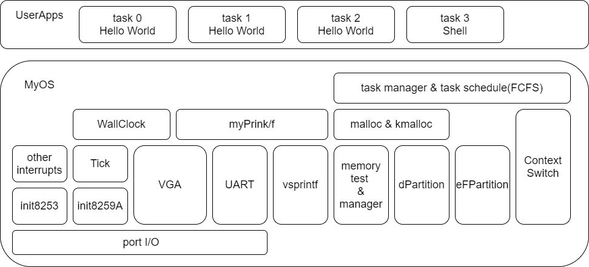
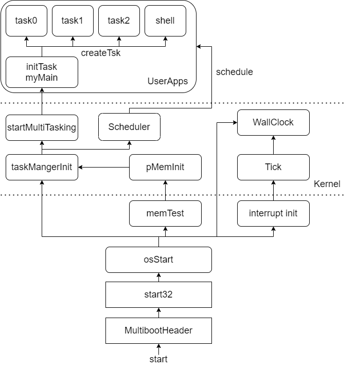
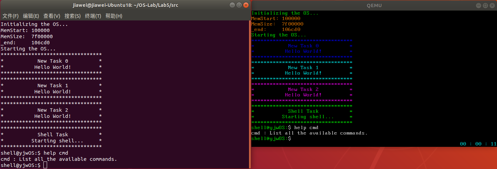
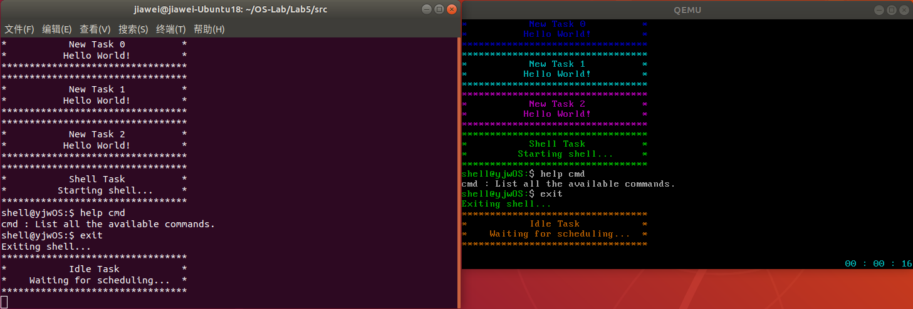

# 实验5 任务管理和FCFS

## 目录

- 原理说明
- 主要功能模块及其实现
- 源代码说明
- 代码布局（地址空间）说明
- 编译过程说明
- 运行和运行结果说明
- 遇到的问题和解决方案

## 原理说明

- **软件结构框图及其概述**

  软件结构框图如下：

  

  本次新增模块的概述：

  通过汇编代码，实现了上下文切换功能。

  基于上下文切换模块，和lab4中实现的内存管理模块，实现了任务管理和任务调度模块。

- **主流程及其实现**

  系统启动和运行的主流程如下：

  

  1. 从multibootHeader.s开始，验证multiboot header，开始引导系统。

  2. 跳转至start32.s，通过汇编，构建堆栈，初始化bss段，初始化中断描述符表idt。

  3. 跳转至osStart.c，进行中断相关初始化，设置墙钟；进行内存相关初始化，实现用户与内核内存的接口。

  4. 进行任务管理器初始化，创建initTsk，将其插入等待队列。然后进入多任务运行状态，进行第一次FCFS调度，也就是运行initTsk。

  5. initTsk的入口是用户程序myMain。在myMain中，创建tsk0、tsk1、tsk2（内容都是输出hello world字样，用于测试），创建shellTsk，依次插入等待队列。initTsk执行结束后，继续FCFS调度，按照插入的顺序执行上述任务，直至全部执行完，切换至idleTsk。

## 主要功能模块及其实现

  本次实验5，是在我自己的实验4代码基础上完成的，过程中参考了助教提供的框架代码。

  - **上下文切换相关**

    - **原理及汇编代码**

      进程的上下文包含以下部分：

      - 通用寄存器 eax, ecx, edx, ebx, esp, ebp, esi, edi

      - 状态寄存器（程序状态字）

      - PC寄存器 eip

      - 栈

      上下文切换，需要保存前一个任务的上下文，然后读取后一个任务的上下文。

      首先，了解一些对上下文切换而言非常重要的寄存器：

      - **eip寄存器**
      
        程序正常运行时，`eip`寄存器保存着当前代码的地址。当一个程序调用另一过程，返回地址会被压入栈中；当从另一过程返回（如执行`ret`指令），会将之前压栈的返回地址出栈，读入到`eip`寄存器中。

        可见，程序正常运行时，一般不需要对`eip`进行手动的入栈出栈操作。

      - **esp和ebp寄存器**

        程序运行时，栈被划分为多个栈帧，当发生函数调用时，会发生栈帧切换。`ebp`指向当前栈帧的底部，`esp`则指向栈帧顶部，初始时与`ebp`相等，随着栈的增长（逆向增长），`esp`会逐渐减小。通常的入栈、出栈过程，通过`esp`实现，之后也只对`esp`进行修改。

        在我们的上下文切换过程中，对栈的保护和读取，就是通过修改当前`esp`寄存器值来实现的。

      了解了这些寄存器后，我们结合具体代码对上下文切换过程加以分析。

      ```x86asm
      # context switch
      .global CTX_SW
      CTX_SW:  
          pushf 
          pusha
          movl prevTSK_StackPtrAddr, %eax
          movl %esp, (%eax)
          movl nextTSK_StackPtr, %esp
          popa 
          popf
          ret
      ```

      当需要进行上下文切换时，先设置好两个全局变量的值：

      `prevTSK_StackPtrAddr`，前一个任务的**栈顶指针的地址**

      `nextTSK_StackPtr`，后一个任务的**栈顶指针值**

      设置好后，调用CTX_SW，这时，`eip`的值会**被自动压入当前任务的栈**。

      然后，通过`pusf`和`pusha`，将状态寄存器和通用寄存器压入栈。

      这样，只要保护了栈，就保护了前一个任务的上下文；而后一个任务的栈中也保存了这些内容（实际上当任务被创建时，我们需要手动压入这些内容，以支持它的初次上下文切换），因此只要依次出栈，就能得到后一个任务的上下文。

      而保护栈的过程通过中间三条`mov`语句实现。先将前一个任务栈顶指针的地址存入寄存器`eax`，然后将此时的`esp`值，也就是当前的栈顶指针值，写入`eax`地址的内存里，也就是写入了前一个任务的栈顶指针中，这样就保护了前一个任务的栈。

      读取时，只需读取后一个任务的栈顶指针的内容到`esp`，就读取到了后一个任务的栈。然后依次将通用寄存器、状态寄存器内容出栈。这时，栈顶内容实际上是之前保存的`eip`内容，最后一条`ret`指令，实际上就是隐式地将其出栈，并写到`eip`中。这样就完成了后一个任务上下文的读取。

    - **任务创建和首次上下文切换的准备工作**

      上面的说明中提到一个问题，CTX_SW这个过程，默认了后一个任务上下文的寄存器已经被保存在栈中。但当一个任务刚被创建，它的这些内容并没有被保存。如果直接进行第一次上下文切换，那必定会出错，发生栈下溢。因此，我们需要在任务被创建后，手动执行这一过程：

      ```C
      // init the stack of a newly-created task, make it prepared for its first CTX_SW
      void stack_init(unsigned long **stk, void (*task)(void)) {
          // push tskbdy() entry address into eip
          *(*stk)-- = (unsigned long)tskEnd; 

          // push tskbdy() entry address into eip
          *(*stk)-- = (unsigned long)task;

          // pushf
          *(*stk)-- = (unsigned long)0x0202; // flag registers

          // pusha
          *(*stk)-- = (unsigned long)0xAAAAAAAA; // eax
          *(*stk)-- = (unsigned long)0xCCCCCCCC; // ecx
          *(*stk)-- = (unsigned long)0xDDDDDDDD; // edx
          *(*stk)-- = (unsigned long)0xBBBBBBBB; // ebx
          *(*stk)-- = (unsigned long)0x44444444; // esp
          *(*stk)-- = (unsigned long)0x55555555; // ebp
          *(*stk)-- = (unsigned long)0x66666666; // esi
          **stk     = (unsigned long)0x77777777; // edi
      }
      ```

      先暂且忽略一个入栈的`tskEnd()`函数首地址，从第二个看起。

      先入栈`task()`，也就是任务函数的入口地址，对应的是`eip`内容，这样，当任务第一次被切换到，开始执行的位置就将是任务函数的起始处。

      然后入栈状态寄存器，它是一个16位的寄存器，入栈内容为默认值`0x0202`，表示允许中断。

      然后入栈八个通用寄存器，具体入栈内容并无特别要求，这里参考了老师的讲解视频。

      这样就人工实现了任务栈的初始化，为第一次上下文切换做好了准备。

      而第一个入栈的`tskEnd()`函数，是一个在每个任务运行结束后，都应该调用的函数。当任务函数`task()`执行结束而`return`时，它也会像`ret`一样，隐式地从栈中读取返回地址。我们将`tskEnd()`首地址压栈，这样每个任务执行结束后，就会自动返回到`tsdEnd()`函数，从而无需用户手动去调用它。

    - **封装接口**

      出于通用性考虑，我没有采用老师的以TCB作为参数的接口，而是定义以下接口：

      ```C
      void CTX_SW(void);

      unsigned long **prevTSK_StackPtrAddr;
      unsigned long *nextTSK_StackPtr;

      void context_switch(unsigned long **prevTskStkAddr, unsigned long *nextTskStk) {
          prevTSK_StackPtrAddr = prevTskStkAddr;
          nextTSK_StackPtr = nextTskStk;
          CTX_SW();
      }
      ```

      `prevTskStkAddr`是前一个任务栈顶指针的地址，`nextTskStk`则是后一个任务的栈顶指针值，这两者由调用者传入，然后赋给对应的全局变量，调用上面说明过的CTX_SW。

  - **任务控制块TCB及其相关操作**

    - **TCB设计**

      定义任务控制块TCB的数据结构如下：

      ```C
      typedef struct myTCB {
          int tid;
          int state;
          unsigned long *stkTop;
          unsigned long *stkMAX;
          void (*entry)(void);
          struct myTCB *next;
      } myTCB;
      ```

      `tid`是任务的索引号。
      
      `state`是任务状态，事实上，我们的实验中实现的只是简化过的进程模型，甚至连三状态模型都没有实现。因此，这里的任务状态，更多地只是一个形式上的实现。我定义了以下状态：

      ```C
      #define TSK_WAITING 0
      #define TSK_READY 1
      #define TSK_RUNNING 2
      ```

      `stkTop`是进程的栈顶指针，是TCB中最重要的内容。

      `stkMAX`是栈在内存中的起始地址，由于栈是逆向生长，从栈的角度看，他就是栈内存空间的最底部。任务创建申请栈空间、任务销毁时释放栈空间，都是以`stkMAX`作为首地址的。此外，它还可起到保护作用，防止下溢。

      `entry`是任务函数的入口地址。

      `next`只用于TCB分配和回收。我采用了TCB池的机制，即在初始化时就建立了指定数量的TCB，为它们分配了空间，通过`next`连接成空闲TCB链表。当创建新任务，只需要分配一个空闲TCB，销毁时则回收它，在这些情况下，`next`会被使用。

    - **任务创建**

      请求分配一个空闲TCB，创建任务，连接任务函数入口，为栈分配内存空间，然后调用前面提到的`stack_init()`函数对栈进行初始化，为第一次上下文切换做好准备。

      返回值是`tid`，应不小于`0`。如果分配失败（没有空闲TCB或栈空间分配失败），则返回`-1`表示错误。

      ```C
      int createTsk(void (*tskBody)(void)) {
          if (!firstFreeTCB)
              return -1;
          
          myTCB *newTsk = firstFreeTCB;
          firstFreeTCB = firstFreeTCB->next;

          newTsk->entry = tskBody;
          newTsk->stkMAX = (unsigned long *)kmalloc(STACK_SIZE);
          if (!newTsk->stkMAX)
		          return -1;
          newTsk->stkTop = newTsk->stkMAX + STACK_SIZE - 1;
          
          stack_init(&newTsk->stkTop, tskBody);

          return newTsk->tid;
      }
      ```

    - **任务销毁**

      传入要销毁的任务的`tid`，释放栈空间，初始化各变量值，回收此TCB，加入空闲TCB链表。

      ```C
      void destroyTsk(int tid) {
          kfree((unsigned long)tcbPool[tid]->stkMAX); //free the stack
          tcbPool[tid]->entry = NULL;
          tcbPool[tid]->state = TSK_WAITING;
          tcbPool[tid]->stkMAX = NULL;
          tcbPool[tid]->stkTop = NULL;
          tcbPool[tid]->next = firstFreeTCB;
          firstFreeTCB = tcbPool[tid];
      }
      ```

    - **任务管理器初始化**

      先初始化TCB池，构建空闲TCB链表：

      ```C
      myTCB *prevTCB = NULL;
      for (int i = 0; i < TASK_NUM; i++) {
          tcbPool[i] = (myTCB *)kmalloc(sizeof(myTCB));
          tcbPool[i]->tid = i;
          tcbPool[i]->entry = NULL;
          tcbPool[i]->state = TSK_WAITING;
          tcbPool[i]->stkMAX = NULL;
          tcbPool[i]->stkTop = NULL;
          tcbPool[i]->next = NULL;
          if (prevTCB) 
              prevTCB->next = tcbPool[i];
          prevTCB = tcbPool[i];
      }
      firstFreeTCB = tcbPool[0];
      ```

      然后为`idleTsk`（睡眠任务）和`initTsk`（初始化任务，本实验中为用户主程序`myMain()`）创建TCB。
      
      接下来，开始`initTsk`任务，将其插入就绪队列。调用`startMultitask()`，转入多任务运行状态，开始第一次调度。`tskStart()`和`startMultitask()`将在下面的调度部分进行说明。

      ```C
      int initTid = createTsk(initTskBody);
      int idleTid = createTsk(idleTskBody);
      idleTsk = tcbPool[idleTid];

      tskStart(initTid);
      
      startMultitask();
      ```

  - **FCFS调度相关**

    - **就绪队列**

      FCFS调度算法，就绪队列是一个普通的FIFO队列。它的定义如下：

      ```C
      typedef struct rdyQueueNode {
          myTCB *TCB;
          struct rdyQueueNode *next;
      } rdyQueueNode;

      // FCFS ready queue for tasks
      typedef struct rdyQueueFCFS {
          rdyQueueNode *head;
          rdyQueueNode *tail;
      } rdyQueueFCFS;
      rdyQueueFCFS rdyQueue;
      ```

      队列的所有操作与普通的FIFO队列没有区别，唯一值得关注的是，如果队列为空，取队头会取到`idleTsk`任务：

      ```C
      myTCB * nextFCFSTsk(void) {
        if (rqFCFSIsEmpty())
            return idleTsk;
        else
            return rdyQueue.head->TCB;
      }
      ```

    - **开始任务**

      将任务插入就绪队列，等待调度。

      ```C
      void tskStart(int tid) {
          tcbPool[tid]->state = TSK_READY;
          tskEnqueueFCFS(tcbPool[tid]);
      }
      ```

    - **开始首次调度**

      初次调度需要我们手动开始，通过`startMultitask()`函数实现。`BspContext`被我定义为系统栈，所有调度操作，应该在这个栈中完成。

      与框架中给出的手动执行`STX_SW()`不同，我将首次调度整合到了调度算法`schedule()`内。实际上，这只不过是设计上的区别。

      ```C
      unsigned long *BspContextBase;
      unsigned long *BspContext;

      void startMultitask(void) {
          // build up the kernal stack
          BspContextBase = (unsigned long *)kmalloc(10 * STACK_SIZE);
          BspContext = BspContextBase + STACK_SIZE - 1;
          
          currentTsk = NULL;

          // start multitasking through schedule
          schedule();
      }
      ```  

    - **调度算法**

      调度算法是FCFS：

      ```C
      void schedule(void) {
          scheduleFCFS();
      }
      ```

      首先从FIFO就绪队列上取一个任务，进行上下文切换。前面提到，**调度算法的执行只能在系统栈中**（这一点需要`tskEnd()`参与维护，下文解释），因此这里的上下文切换，是从**系统栈上下文环境**，切换到**目标任务上下文环境**。

      如果是首次调度，这时`currentTsk`还为`NULL`，则直接从`BspContext`切换到目标任务`nextStk`的上下文；如果不是首次调度，则先销毁`currentTsk`（FCFS，任务运行完才会请求调度，因此可销毁），再切换到`nextStk`。

      注意，这里的上下文切换保存了系统栈`BspContext`的上下文。当进程运行结束，通过`tskEnd()`切换回此上下文，也就返回到了循环体的尾部，将开启新一轮循环，开启新的调度过程。这样就实现了在任务执行完毕后，调用调度算法的要求。

      如果所有任务都已执行完，那么`nextFCFSTsk()`会取到`idleTsk`，然后回切换到`idleTsk`。`idleTsk`会一直在死循环中调用调度函数，以便新任务出现时及时进行调度。如果没有新任务，则`currentTsk`和`nextTsk`都是`idleTsk`，不需要做任何切换。

      ```C
      void scheduleFCFS(void) {
          while (1) {
              myTCB *nextTsk = nextFCFSTsk();

              if (nextTsk == idleTsk && currentTsk == idleTsk)
                  // current task is the idleTask, and the ready queue is empty
                  return; // do nothing
                
              // schedule, context switch
              if (currentTsk)
                  destroyTsk(currentTsk->tid);

              nextTsk->state = TSK_RUNNING;
              currentTsk = nextTsk;
                
              context_switch(&BspContext, currentTsk->stkTop);
          }
      }
      ```

    - **结束任务**

      任务函数执行结束后，会从栈中取到初始化时压入的`tskEnd()`，写入`eip`中。从而任务结束后，会自动调用`tskEnd()`。

      `tskEnd()`首先将此任务从就绪队列中移除，然后切换回系统栈上下文`BspContext`中。

      之前在调度算法中，我们已经保存了`BspContext`上下文，现在切换回去，结合调度算法函数中的死循环，就将开始新一轮的调度。

      ```C
      void tskEnd(void) {
          // dequeue the current task from the ready queue
          tskDequeueFCFS();
          // return to the context which resides in the kernel stack
          context_switch(&currentTsk->stkTop, BspContext);
      }
      ```

    - **idle任务**

      当系统中没有任何其他任务时，才会切换到此任务。此任务不断进行死循环，其中调用调度算法，等待新任务的到来。

      ```C
      void idleTskBody(void) {
          myPrintf(0x6, "*********************************\n");
          myPrintf(0x6, "*           Idle Task           *\n");
          myPrintf(0x6, "*    Waiting for scheduling...  *\n");
          myPrintf(0x6, "*********************************\n");

          while (1)
              schedule();
      }
      ```

  - **用户层任务创建**

    本次实验对用户主程序`myMain()`进行了修改，它不再直接启动shell，而是将其创建为与其他任务同等地位的任务：

    ```C
    void myMain(void) {
        int shellTid = createTsk(shell);
        int newTskTid0 = createTsk(myTsk0);
        int newTskTid1 = createTsk(myTsk1);
        int newTskTid2 = createTsk(myTsk2);
        tskStart(newTskTid0);
        tskStart(newTskTid1);
        tskStart(newTskTid2); 
        tskStart(shellTid);
    }
    ```

    这些任务的定义如下。`myTsk0`、`myTsk1`、`myTsk2`都是类似的，不做重复展示。
    ```C
    void myTsk0(void) {
        myPrintf(0x1, "*********************************\n");
        myPrintf(0x1, "*           New Task 0          *\n");
        myPrintf(0x1, "*          Hello World!         *\n");
        myPrintf(0x1, "*********************************\n");
    }

    void shell(void) {
        myPrintk(0x2, "*********************************\n");
        myPrintk(0x2, "*           Shell Task          *\n");
        myPrintk(0x2, "*         Starting shell...     *\n");
        myPrintk(0x2, "*********************************\n");

        initShell();
        memTestCaseInit();
        startShell();
    }
    ```

## 源代码说明

  - **目录组织**

    ```java
    src
    ├── multibootheader
    │   └── multibootHeader.S // mutlibootheader
    ├── myOS
    │   ├── dev
    │   │   ├── i8253.c // i8253初始化模块
    │   │   ├── i8259A.c // i8259初始化模块
    │   │   ├── uart.c // uart输出模块
    │   │   └── vga.c // vga输出模块
    │   ├── i386
    │   │   ├── CTX_SW.S // 上下文切换汇编代码
    │   │   ├── io.c // 端口io模块
    │   │   ├── irq.S // 中断处理相关汇编代码
    │   │   ├── irqs.c // 中断处理相关C代码
    │   ├── include // 各头文件
    │   │   ├── interrupt.h
    │   │   ├── io.h
    │   │   ├── kmalloc.h
    │   │   ├── malloc.h
    │   │   ├── mem.h
    │   │   ├── myPrintk.h
    │   │   ├── string.h
    │   │   ├── tick.h
    │   │   ├── uart.h
    │   │   ├── vga.h
    │   │   ├── vsprintf.h
    │   │   └── wallClock.h
    │   ├── kernel
    │   │   ├── mem // 内存相关
    │   │   │   ├── dPartition.c // 动态内存分区管理算法
    │   │   │   ├── eFPartition.c // 等大小内存分区管理算法
    │   │   │   ├── malloc.c // malloc和kmalloc实现
    │   │   │   └── pMemInit.c // 内存检测和用户、内核分区初始化
    │   │   ├── task.c // 任务管理模块
    │   │   ├── tick.c // tick模块
    │   │   └── wallClock.c // 墙钟模块
    │   ├── lib // 自编或移植的库函数
    │   │   ├── string.c
    │   │   └── vsprintf.c
    │   ├── osStart.c // 系统启动过程的C代码
    │   ├── printk
    │   │   └── myPrintk.c // myPrintk/f模块
    │   └── start32.S // 系统启动过程的汇编代码
    │   └── userInterface.h // OS提供给用户程序的接口
    └── userApp
        ├── main.c // 用户初始化任务
        ├── memTestCase.c // 内存管理算法测试用例
        ├── memTestCase.h
        ├── shell.c // shell模块
        ├── shell.h
        ├── userApp.h // 用户任务相关头文件
        └── userTasks.c // 各个用户任务函数
    ```

  - **Makefile组织**

    ```
    src
    ├── myOS
    │   ├── dev
    │   ├── i386
    │   ├── kernel
    │   │   └── mem
    │   ├── lib
    │   └── printk
    └── userApp
    ```  

## 代码布局（地址空间）说明

本次的代码布局（地址空间）与前几次实验相同：

| Offset | field      |  Note | 
| ------------------- | ----------------- | -----|
| 1M                   | .text              | 代码段   |
| ALIGN(16)           | .data              | 数据段   |
| ALIGN(16)           | .bss             | bss段   |
| ALIGN(16)           |               | _end 空闲内存起始地址 |

ALIGN(16)表示起始地址按16字节对齐。


## 编译过程说明

主要Makefile文件：

```makefile
SRC_RT = $(shell pwd)

CROSS_COMPILE=
ASM_FLAGS = -m32 --pipe -Wall -fasm -g -O1 -fno-stack-protector	
C_FLAGS = -m32 -fno-stack-protector -fno-builtin -g

.PHONY: all
all: output/myOS.elf

MULTI_BOOT_HEADER = output/multibootheader/multibootHeader.o
include $(SRC_RT)/myOS/Makefile
include $(SRC_RT)/userApp/Makefile

OS_OBJS = ${MYOS_OBJS} ${USER_APP_OBJS}

output/myOS.elf: ${OS_OBJS} ${MULTI_BOOT_HEADER}
    ${CROSS_COMPILE}ld -n -T myOS/myOS.ld ${MULTI_BOOT_HEADER} ${OS_OBJS} -o output/myOS.elf

output/%.o : %.S
    @mkdir -p $(dir $@)
    @${CROSS_COMPILE}gcc ${ASM_FLAGS} -c -o $@ $<

output/%.o : %.c
    @mkdir -p $(dir $@)
    @${CROSS_COMPILE}gcc -I myOS/include -I userApp -I myOS ${C_FLAGS} -c -o $@ $<

clean:
    rm -rf output
```

编译过程分为两步：

1. 编译各个汇编.S源文件与c语言.c源文件，生成.o文件。这一步需要包括各目录下的Makefile文件。

2. 将各.o文件进行链接，生成可执行的myOS.elf文件。

## 运行和运行结果说明

- **运行过程**

  打开源码所在目录，通过编写好的脚本一键编译与运行：

  ```sh
  ./source2img.sh
  ```

  接下来键入命令（x为`0`、`1`等，视具体情况而定）：

  ```sh
  sudo screen /dev/pts/x
  ```

  即可进入交互界面，通过重定向的串口与qemu交互。  

- **运行结果说明**

  如图所示，启动系统，发现tsk0、tsk1、tsk2、shell依照它们被插入就绪队列的顺序运行了，shell功能正常。这说明任务管理正常，初始化正常，`initTsk()`被正确地执行了，上下文切换与FCFS调度也是正常的。

  

  然后输入`exit`指令退出shell，此时所有任务都已执行完，如图所示，正确地运行了`idleTsk()`。

  

  至此，完成了本次实验的全部要求。