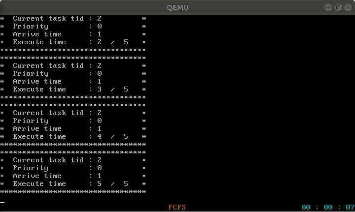

# 实验6 调度算法

## 目录

- 原理说明
- 主要功能模块及其实现
- 源代码说明
- 代码布局（地址空间）说明
- 编译过程说明
- 运行和运行结果说明

## 原理说明

- **软件结构框图及其概述**

  软件结构框图如下，图片仅展示大体结构：

  

  本次改动或新增模块的概述：

  - 任务队列数据结构：
  
    - taskQueueFIFO：TCB的先进先出队列
    
    - taskQueuePrio：TCB的优先队列（出队元素是最小元素/最大元素，需指定比较函数）

  - 任务到达模块：taskArrv，基于优先队列和tick实现

  - 任务参数模块：taskPara，可设置任务的参数，包含到达时间，优先级，执行时间

  - 调度算法模块：
  
    - schedulerFCFS，FCFS调度，基于先进先出队列实现

    - schedulerSJF，非抢占SJF调度，基于优先队列实现

    - schedulerPrio，非抢占优先级调度，允许每个优先级有多个任务，基于优先队列实现

    - schedulerRR，时间片轮转调度，基于先进先出队列和tick实现

  - 调度器抽象接口：scheduler，基于以上四种调度算法模块实现，向任务管理器提供统一接口

  - 任务管理器模块：task，基于任务到达模块、任务参数模块、调度器接口实现

- **主流程及其实现**

  系统启动和运行的主流程如下：

  

  1. 从multibootHeader.s开始，验证multiboot header，开始引导系统。

  2. 跳转至start32.s，通过汇编，构建堆栈，初始化bss段，初始化中断描述符表idt。

  3. 跳转至osStart.c，进行中断相关初始化，初始化tick，设置墙钟；进行内存相关初始化，实现用户与内核内存分配、回收的接口。

  4. 进行任务管理器初始化，包括任务池初始化、任务到达队列初始化、调度器初始化、创建初始任务、向tick注册hook函数，然后进入多任务运行状态，调度器启动。

  5. 开始执行初始任务，根据用户选择，创建对应的调度算法测试用例任务，或创建shell任务。

## 主要功能模块及其实现

  本次实验6，是在我自己的实验5代码基础上完成的，过程中参考了助教提供的框架代码。

  - **TCB先进先出队列数据结构**

    TCB的先进先出队列是FCFS调度、RR调度的基础。与lab5相比，没有太多变化，主要是独立成了一个模块。

    定义如下：

    ```C
    typedef struct queueNodeFIFO {
        myTCB *TCB;
        struct queueNodeFIFO *next;
    } queueNodeFIFO;

    typedef struct taskQueueFIFO {
        queueNodeFIFO *head;
        queueNodeFIFO *tail;
    } taskQueueFIFO;
    ```

    队列操作接口如下：

    ```C
    void taskQueueFIFOInit(taskQueueFIFO *queue);
    int taskQueueFIFOEmpty(taskQueueFIFO *queue);
    myTCB * taskQueueFIFONext(taskQueueFIFO *queue);
    void taskQueueFIFOEnqueue(taskQueueFIFO *queue, myTCB *tsk);
    myTCB * taskQueueFIFODequeue(taskQueueFIFO *queue);
    ```

    值得一提的是，本次实验中，出、入队操作前后需要关开中断保护，例如入队函数：

    ```C
    void taskQueueFIFOEnqueue(taskQueueFIFO *queue, myTCB *tsk) {
        queueNodeFIFO *newNode = (queueNodeFIFO *)kmalloc(sizeof(queueNodeFIFO));
        if (!newNode)
            return;

        newNode->TCB = tsk;
        newNode->next = NULL;

        disable_interrupt();
        if (taskQueueFIFOEmpty(queue))
            queue->head = queue->tail = newNode;
        else {
            queue->tail->next = newNode;
            queue->tail = newNode;
        }
        enable_interrupt();
    }
    ```

  - **TCB优先队列数据结构**

    优先队列是任务到达队列、优先级调度、SJF调度的基础。为了适应多种功能需求，我们允许用户指定比较函数。

    数据结构定义如下：

    ```C
    typedef struct taskQueuePrio {
        myTCB **tcb;
        int tail;
        int capacity;
        int (*cmp)(const myTCB *a, const myTCB *b);
    } taskQueuePrio;
    ```

    `tcb`是队列中TCB的指针的顺序表，动态分配；`tail`是队尾下标；`capacity`是队列容量；`cmp`是比较函数。

    与先进先出队列不同，优先队列采用了顺序表结构，而非链结构，这主要是为了简化入队、出队的代码。

    队列操作接口定义如下：

    ```C
    void taskQueuePrioInit(taskQueuePrio **queue, int capacity, 
                           int (*cmp)(const myTCB *a, const myTCB *b));
    int taskQueuePrioEmpty(taskQueuePrio *queue);
    myTCB * taskQueuePrioNext(taskQueuePrio *queue);
    void taskQueuePrioEnqueue(taskQueuePrio *queue, myTCB *tsk);
    myTCB * taskQueuePrioDequeue(taskQueuePrio *queue);
    ```

    操作包括初始化、判断队空、获取队头元素、出队、入队。

    优先队列中，最小（或最大）的元素永远位于队头，这是通过小根（或大根）思想实现的，具体实现代码不在此赘述，它并非重点。
    
    当然，同样需要注意，入队、出队操作需要关、开中断保护。

  - **TCB数据结构**

    TCB数据结构较lab5增添了一些新的内容。其定义如下：

    ```C
    typedef struct myTCB {
        int tid;
        int state;
        unsigned int runTime;
        unsigned int lastScheduledTime; 
        unsigned long *stkTop;
        unsigned long *stkMAX;
        void (*entry)(void);
        tskPara *para;
        struct myTCB *next;
    } myTCB;
    ```

    增加了运行时间`runTime`，记录了任务从运行期间的总Tick次数；
    
    `lastScheduledTime`为任务最近被调度的时刻，它记录了任务获得调度、开始本次运行的时刻，主要用于RR调度中的保护；

    `para`为任务的参数，采用了抽象定义，需要通过参数模块提供的函数接口来进行初始化和设置。具体内容见任务参数模块。

  - **任务参数模块**

    任务参数定义如下：

    ```C
    typedef struct tskPara {
        int priority;
        int exec_time;
        int arrv_time;
    } tskPara;
    ```

    包括优先级、执行时间、到达时间，都是需要人为设定的。

    任务参数的操作函数接口定义如下：

    ```C
    void initTskPara(tskPara **para);
    void setTskPara(unsigned int option, unsigned int value, tskPara *para);
    unsigned int getTskPara(unsigned option, tskPara *para);
    ```

    `initTskPara`为任务参数初始化函数，它会为参数分配内存空间，并设定默认值：

    ```C
    void initTskPara(tskPara **para) {
        *para = (tskPara *)kmalloc(sizeof(tskPara));
        (*para)->arrv_time = 0;
        (*para)->exec_time = 0;
        (*para)->priority = 0;
    }
    ```

    `setTskPara`为任务参数设置函数，用户传入要设置的参数类型、参数值和参数指针，进行设定：

    ```C
    void setTskPara(unsigned int option, unsigned int value, tskPara *para) {
        switch (option) {
            case PRIORITY:
                para->priority = value > MAX_PRIORITY ? MAX_PRIORITY : value;
                break;
            case EXEC_TIME:
                para->exec_time = value > MAX_EXEC_TIME ? MAX_EXEC_TIME : value;
                break;
            case ARRV_TIME:
                para->arrv_time = value;
                break;
            default:
                break;
        }
    }
    ```

    `getTskPara`为任务参数获取函数，用户传入要获取的参数类型和参数指针，返回对应参数值：

    ```C
    unsigned int getTskPara(unsigned int option, tskPara *para) {
        switch (option) {
            case PRIORITY:
                return para->priority;
            case EXEC_TIME:
                return para->exec_time;
            case ARRV_TIME:
                return para->arrv_time;
            default:
                return 0;
        }
    }
    ```

  - **任务操作**

    与lab5相同，任务操作有以下函数：
    
    ```C
    int createTsk(void (*tskBody)(void));
    void destroyTsk(int tid);
    void tskStart(int tid);
    void tskEnd(void);
    ```

    其中`createTsk`提供给用户程序，`destroyTsk`、`tskStart`提供给调度器和任务到达模块，`tskEnd`则在初始化时压入任务的栈，任务函数运行结束返回时，会自动调用`tskEnd`。

    本次，新增了任务参数，而且调度算法换用抽象接口。相应地，需要对这些操作函数作相应修改：

    ```C
    int createTsk(void (*tskBody)(void)) {
        if (!firstFreeTCB)
            return -1;
        
        myTCB *newTsk = firstFreeTCB;
        firstFreeTCB = firstFreeTCB->next;

        initTskPara(&newTsk->para);
        newTsk->runTime = 0;
        newTsk->entry = tskBody;
        newTsk->lastScheduledTime = 0;
        newTsk->stkMAX = (unsigned long *)kmalloc(STACK_SIZE);
        if (!newTsk->stkMAX)
            return -1;	
        newTsk->stkTop = newTsk->stkMAX + STACK_SIZE - 1;
        
        stack_init(&newTsk->stkTop, tskBody);

        return newTsk->tid;
    }
    ```

    创建任务时，需要初始化任务参数、任务运行时间、任务最近被调度的时刻。

    ```C
    void destroyTsk(int tid) {
        kfree((unsigned long)tcbPool[tid]->stkMAX);
        kfree((unsigned long)tcbPool[tid]->para);
        tcbPool[tid]->runTime = 0;
        tcbPool[tid]->lastScheduledTime = 0;
        tcbPool[tid]->entry = NULL;
        tcbPool[tid]->state = TSK_WAITING;
        tcbPool[tid]->stkMAX = NULL;
        tcbPool[tid]->stkTop = NULL;
        tcbPool[tid]->next = firstFreeTCB;
        firstFreeTCB = tcbPool[tid];
    }
    ```

    摧毁任务时，需要一并释放任务参数所使用的内存空间。

    ```C
    void tskStart(int tid) {
        tcbPool[tid]->state = TSK_READY;
        sysSch.enqueueTsk(tcbPool[tid]);
    }
    ```

    任务的开始函数，实际上是将任务插入就绪队列，改用调度器的抽象接口。

  - **秒级定时器**

    本次实验涉及很多与时钟相关的操作。tick频率过高，使用不方便，因此，特实现了一个以**秒**为单位的定时器。
    
    具体实现完全类似lab3中的墙钟，`timer_seconds`为当前定时器的值，作为当前系统时间，以hook函数`update_timer`去维护。

    当定时器初始化时，将计时值置零，然后注册hook函数。

    ```C
    unsigned int timer_seconds;

    void update_timer(void) {
        if (get_tick_times() % TICK_FREQ != 0)
            return;

        timer_seconds++;
    }

    void init_timer(void) {
        timer_seconds = 0;
        append2HookList(update_timer);
    }

    unsigned int get_current_time(void) {
        return timer_seconds;
    }
    ```

  - **任务到达**

    不同于lab5的在初始化时将所有任务插入就绪队列，本次实验实现了任务的不同到达时间。

    我们默认任务被创建后就是就绪状态。实际情况中，一个任务到达后，应当直接进入就绪队列。但这一过程实现起来比较复杂，难以管理，用户使用也不方便。

    因此，我们定义一个优先队列，作为到达队列，利用时钟中断，定期检查到达队列，来模拟实际情况下的任务到达过程。

    ```C
    taskQueuePrio *arrvQueue;
    ```

    当一个任务被创建，它首先应被插入到达队列。

    每次tick（频率100Hz）发生，都会检测该队列，检查到达队列中**到达时间最小**的任务，如果当前时间不小于其到达时间，则将其取出，插入就绪队列。

    为此，需要一个比较函数，比较任务到达时间：

    ```C
    int compare_arrv_time(const myTCB *a, const myTCB *b) {
        return getTskPara(ARRV_TIME, a->para) - getTskPara(ARRV_TIME, b->para);
    }
    ```

    一个hook函数，实现周期性检查就绪队列、开始任务：

    ```C
    void startArrivedTask_hook(void) {
        if (taskQueuePrioEmpty(arrvQueue))
            return;

        myTCB *nextTask = taskQueuePrioNext(arrvQueue);
        if (get_current_time() >= getTskPara(ARRV_TIME, nextTask->para)) {
            tskStart(nextTask->tid);
            taskQueuePrioDequeue(arrvQueue);
        }
    }
    ```

    初始化时，除了初始化队列，还需要注册hook函数：

    ```C
    void taskArrvQueueInit(void) {
        taskQueuePrioInit(&arrvQueue, taskNum, compare_arrv_time);
        append2HookList(startArrivedTask_hook);
    }
    ```

    将任务插入到达队列的函数接口，该接口会提供给用户程序，在创建任务后调用。当然，如果任务的到达时间为0，那就不需要将其插入到达队列，而是直接插入就绪队列。

    ```C
    void enableTask(int tid) {
        if (tcbPool[tid]->para->arrv_time == 0)
            tskStart(tid);
        else
            taskQueuePrioEnqueue(arrvQueue, tcbPool[tid]);
    }
    ```

  - **调度器抽象接口**

    遵循机制与策略相分离的原则，调度器向任务管理器提供的是抽象接口，与具体调度算法无关。

    定义一个调度器数据结构，其中包含调度算法类型和各操作接口：

    ```C
    typedef struct scheduler {
        unsigned int type;

        myTCB * (*nextTsk)(void);
        void (*enqueueTsk)(myTCB *tsk);
        myTCB * (*dequeueTsk)(void);
        void (*schedulerInit)(void);
        void (*schedule)(void);
        void (*tick_hook)(void);
    } scheduler;
    ```

    定义为一个全局变量：

    ```C
    scheduler sysSch;
    ```

    向外提供一个初始化函数接口，其功能是将具体的调度算法接口连接到抽象接口上，并在vga屏幕底端显示当前调度算法类型。

    此函数根据`sysSch.type`判断所要初始化的调度算法，而`sysSch.type`将在系统启动时，由用户选择决定。

    ```C
    void initSysSch(void) {
        switch (sysSch.type) {
            case FCFS:
                sysSch.schedulerInit = schedulerInitFCFS;
                sysSch.nextTsk = nextTskFCFS;
                sysSch.enqueueTsk = enqueueTskFCFS;
                sysSch.dequeueTsk = dequeueTskFCFS;
                sysSch.schedule = scheduleFCFS;
                sysSch.tick_hook = NULL;
                put_chars("FCFS", 0x6, 
                          VGA_SCREEN_HEIGHT - 1, 
                          VGA_SCREEN_WIDTH  / 2 - 2);
                break;
            case RR:
                sysSch.schedulerInit = schedulerInitRR;
                sysSch.nextTsk = nextTskRR;
                sysSch.enqueueTsk = enqueueTskRR;
                sysSch.dequeueTsk = dequeueTskRR;
                sysSch.schedule = scheduleRR;
                sysSch.tick_hook = preemptCurrentTaskRR_hook;
                append2HookList(preemptCurrentTaskRR_hook);
                put_chars(" RR ", 0x6, 
                          VGA_SCREEN_HEIGHT - 1, 
                          VGA_SCREEN_WIDTH  / 2 - 2);
                break;
            case PRIO:
                sysSch.schedulerInit = schedulerInitPrio;
                sysSch.nextTsk = nextTskPrio;
                sysSch.enqueueTsk = enqueueTskPrio;
                sysSch.dequeueTsk = dequeueTskPrio;
                sysSch.schedule = schedulePrio;
                sysSch.tick_hook = NULL;
                put_chars("PRIO", 0x6, 
                          VGA_SCREEN_HEIGHT - 1, 
                          VGA_SCREEN_WIDTH  / 2 - 2);
                break;
            case SJF:
                sysSch.schedulerInit = schedulerInitSJF;
                sysSch.nextTsk = nextTskSJF;
                sysSch.enqueueTsk = enqueueTskSJF;
                sysSch.dequeueTsk = dequeueTskSJF;
                sysSch.schedule = scheduleSJF;
                sysSch.tick_hook = NULL;
                put_chars("SJF", 0x6, 
                          VGA_SCREEN_HEIGHT - 1, 
                          VGA_SCREEN_WIDTH  / 2 - 2);
                break;
        }
        sysSch.schedulerInit();
    }
    ```

    系统启动时让用户选择调度算法，对osStart.c做修改实现，比较简单，这里不展示代码了。

  - **CTX_SW**

    ```x86asm
    .globl CTX_SW
    CTX_SW:  
        call disableInterrupt
        pushf 
        pusha
        movl prevTSK_StackPtrAddr, %eax
        movl %esp, (%eax)
        movl nextTSK_StackPtr, %esp
        popa 
        popf
        call enableInterrupt
        ret
    ```

    进程的上下文切换原语。本次实验中，需要关、开中断保护。

  - **FCFS调度**

    基于lab5中的FCFS，修改实现，区别不大。

    FCFS的就绪队列，一个FIFO队列：

    ```C
    taskQueueFIFO *rdyQueueFCFS;
    ```

    出队、入队、初始化等函数：

    ```C
    myTCB * nextTskFCFS(void) {
        return taskQueueFIFONext(rdyQueueFCFS);
    }

    void enqueueTskFCFS(myTCB *tsk) {
        taskQueueFIFOEnqueue(rdyQueueFCFS, tsk);
    }

    myTCB * dequeueTskFCFS(void) {
        return taskQueueFIFODequeue(rdyQueueFCFS);
    }

    void schedulerInitFCFS(void) {
        taskQueueFIFOInit(rdyQueueFCFS);
    }
    ```

    调度函数：

    ```C
    void scheduleFCFS(void) {
        while (1) {
          
          myTCB *nextTsk;
          int idleTid;

          if (taskQueueFIFOEmpty(rdyQueueFCFS)) {
              if (!idleTsk) 
                  idleTid = createTsk(idleTskBody);

              nextTsk = idleTsk = tcbPool[idleTid];
          }
          else
              nextTsk = dequeueTskFCFS();

          if (nextTsk == idleTsk && currentTsk == idleTsk)
              continue; // do nothing
            
          if (currentTsk ) {
              if (currentTsk->para->exec_time * TICK_FREQ <= currentTsk->runTime || 
                  currentTsk == idleTsk)
                  destroyTsk(currentTsk->tid);
              if (currentTsk == idleTsk)
                  idleTsk = NULL;
          }

            nextTsk->state = TSK_RUNNING;
            currentTsk = nextTsk;
            
            context_switch(&BspContext, currentTsk->stkTop);
        }
    }
    ```

    与lab5相比，改动之处有：

    第一处改动，只是一个细节设计问题。本次实验引入了到达时间、执行时间，在一次测试中，有可能出现多次就绪队列为空的情况，也就是可能多次回到`idleTsk`。为了实现每次进入`idleTsk`都显示且仅显示一次`idleTsk`的信息，本次实验在每次要进入`idleTsk`前，都创建一次新的`idleTsk`，每次`idleTsk`运行完，都跟其他任务一样，将其销毁。

    另一个改动是，摧毁任务之前需要判断运行时间（单位：秒）是否大于等于预期执行时间（单位：tick），这样可以得到此次调度的原因：是进程执行完了，还是其他原因（RR抢占、进入多任务运行的初次调度）。以此来决定是否要摧毁任务。

    为何运行时间和预期执行时间的单位不同？运行时间是需要精确计量的，以便于任务忙等函数的正确实现，因此采用1 tick为单位。而预期执行时间的单位实际上没有严格限制，方便起见，设定为1s。

  - **SJF非抢占调度**

    就绪队列改用优先队列：

    ```C
    taskQueuePrio *rdyQueueSJF;
    ```

    每次调度，选择运行时间最短的任务；若运行时间相同，选择到达较早的任务。为此，定义一个比较函数：

    ```C
    int compare_exec_time(const myTCB *a, const myTCB *b) {
        if (getTskPara(EXEC_TIME, a->para) == 
            getTskPara(EXEC_TIME, b->para))

            return getTskPara(ARRV_TIME, a->para) - 
                   getTskPara(ARRV_TIME, b->para);
        else
            return getTskPara(EXEC_TIME, a->para) - 
                   getTskPara(EXEC_TIME, b->para);
    }
    ```

    各通用接口函数：

    ```C
    myTCB * nextTskSJF(void) {
        return taskQueuePrioNext(rdyQueueSJF);
    }

    void enqueueTskSJF(myTCB *tsk) {
        taskQueuePrioEnqueue(rdyQueueSJF, tsk);
    }

    myTCB * dequeueTskSJF(void) {
        return taskQueuePrioDequeue(rdyQueueSJF);
    }

    void schedulerInitSJF(void) {
        taskQueuePrioInit(&rdyQueueSJF, taskNum, compare_exec_time);
    }
    ```

    而调度函数与FCFS并无显著区别，只是将入队、出队、队空等操作函数换为了SJF的函数，为节约篇幅，这里不重复展示了。

  - **优先级非抢占调度**

    每次调度，选择优先级最高（优先级数字最小）的任务；若优先级相同，则选择到达最早的任务。
    
    此调度的实现与SJF非抢占调度高度相似，只是改变了比较函数。此处只展示比较函数和调度器初始化函数，其他内容不重复展示了。

    ```C
    int compare_priority(const myTCB *a, const myTCB *b) {
        if (getTskPara(PRIORITY, a->para) == 
            getTskPara(PRIORITY, b->para))

            return getTskPara(ARRV_TIME, a->para) - 
                   getTskPara(ARRV_TIME, b->para);
        else
            return getTskPara(PRIORITY, a->para) - 
                   getTskPara(PRIORITY, b->para);
    }
    ```

    ```C
    taskQueuePrio *rdyQueuePrio;

    void schedulerInitPrio(void) {
        taskQueuePrioInit(&rdyQueuePrio, taskNum, compare_priority);
    }
    ```

  - **RR调度**

    RR调度的就绪队列是FIFO队列：

    ```C
    taskQueueFIFO *rdyQueueRR;
    ```

    各通用函数：
    ```C
    myTCB * nextTskRR(void) {
        return taskQueueFIFONext(rdyQueueRR);
    }

    void enqueueTskRR(myTCB *tsk) {
        taskQueueFIFOEnqueue(rdyQueueRR, tsk);
    }

    myTCB * dequeueTskRR(void) {
        return taskQueueFIFODequeue(rdyQueueRR);
    }

    void schedulerInitRR(void) {
        taskQueueFIFOInit(rdyQueueRR);
    }
    ```

    调度函数：
    ```C
    void scheduleRR(void) {
        while (1) {

            myTCB *nextTsk;
            int idleTid;

            if (taskQueueFIFOEmpty(rdyQueueRR)) {
                if (!idleTsk) 
                    idleTid = createTsk(idleTskBody);

                nextTsk = idleTsk = tcbPool[idleTid];
            }
            else
                nextTsk = dequeueTskRR();

            if (nextTsk == idleTsk && currentTsk == idleTsk)
                continue;
            
            if (currentTsk) {
                if (currentTsk->para->exec_time * TICK_FREQ <= 
                    currentTsk->runTime || 
                    currentTsk == idleTsk)
                    destroyTsk(currentTsk->tid);

                if (currentTsk == idleTsk)
                    idleTsk = NULL;
            }

            nextTsk->state = TSK_RUNNING;
            currentTsk = nextTsk;
            
            currentTsk->lastScheduledTime = get_current_time();
            context_switch(&BspContext, currentTsk->stkTop);
        }
    }
    ```

    与其他算法的调度函数基本一致，不同之处在于，需要记录此次调度发生的时间：

    ```C
    currentTsk->lastScheduledTime = get_current_time();
    ```

    这将用于时间片用完时抢占调度时的保护。

    时间片用完时抢占调度：

    ```C
    void preemptCurrentTaskRR_hook(void) {
        if (currentTsk == idleTsk)
            return;
      
        if (currentTsk->runTime % (TIME_SLICE * TICK_FREQ) == 0 && 
            get_current_time() > currentTsk->lastScheduledTime) {
            currentTsk->state = TSK_READY;
            enqueueTskRR(currentTsk);
            context_switch(&currentTsk->stkTop, BspContext);
        }
    }
    ```

    用一个hook函数来实现，每次tick发生时，检查当前任务的运行时间（单位：tick），如果可以整除时间片大小（单位：秒），且当前时间大于此任务最近一次被调度的时间，则进行抢占调度。

    为何用任务的运行时间作判断？这样可以提高灵活性，时间片的判断不是死板地依据系统时间，而是依据当前进程的运行时间。这样可以正确实现：进程运行结束，但时间片未用完，此时依然发生调度，而不等待至时间片结束再调度。

  - **其他杂项功能**

    - **每秒显示当前任务的信息**

      ```C
      void showCurrentTskParaInfo_hook(void) {
          if (get_tick_times() % TICK_FREQ != 0 || startShellFlag)
              return;

          if (currentTsk == idleTsk) // dont't show idleTsk's info
              return;

          myPrintk(0x7, "*********************************\n");
          myPrintk(0x7, "*  Current task tid : %-2d        *\n", 
                   currentTsk->tid);
          myPrintk(0x7, "*  Priority         : %-2d        *\n", 
                   getTskPara(PRIORITY, currentTsk->para));
          myPrintk(0x7, "*  Arrive time      : %-2d        *\n", 
                   getTskPara(ARRV_TIME, currentTsk->para));
          myPrintk(0x7, "*  Execute time     : %-2d / %2d   *\n", 
                   (currentTsk->runTime + 50) / TICK_FREQ, 
                   getTskPara(EXEC_TIME, currentTsk->para));
          myPrintk(0x7, "*********************************\n");
      }
      ```

      用hook函数实现，显示`tid`，优先级，到达时间，已运行时间，预期执行时间。

      由于运行时间单位不同（tick），需要进行单位转化、四舍五入为秒。

    - **当前任务运行时间更新**    

      ```C
      void updateCurrentTskRunTime_hook(void) {
          disable_interrupt();
          currentTsk->runTime++;
          enable_interrupt();
      }
      ```

      用hook函数实现，每次tick更新当前任务的运行时间。

      更新前后关、开中断，进行保护。

    - **忙等函数**

      此函数将在任务的函数体内被调用，使任务忙等一段时间，用于模拟任务的执行过程。

      助教提供的方案是，粗略估计一秒能执行多少条乘法操作，用若干条乘法操作实现忙等。经测试发现存在一定误差，可能是不同设备硬件性能差异导致的。因此，采用其他方案：

      ```C
      void task_execute(unsigned int wait_time) {
	        while (currentTsk->runTime < 
                 getTskPara(EXEC_TIME, currentTsk->para) * TICK_FREQ);
      }
      ```

      当进程的运行时间（单位：tick）小于进程预期的执行时间（单位：s），则一直循环忙等。

      运行时间每次tick都更新一次，tick的频率`TICK_FREQ`是100Hz，这样，误差可小于0.01s。

## 源代码说明

  - **目录组织**

    ```java
    Src
    ├── multibootheader
    │   └── multibootHeader.S // mutlibootheader
    ├── myOS
    │   ├── dev
    │   │   ├── i8253.c // i8253初始化模块
    │   │   ├── i8259A.c // i8259初始化模块
    │   │   ├── uart.c // 串口输出模块
    │   │   └── vga.c // vga输出模块
    │   ├── i386
    │   │   ├── CTX_SW.S // 上下文切换汇编
    │   │   ├── io.c // 硬件端口IO
    │   │   ├── irq.S // 中断请求处理汇编代码
    │   │   └── irqs.c // 中断请求处理C代码
    │   ├── include // 各头文件
    │   │   ├── interrupt.h
    │   │   ├── io.h
    │   │   ├── kmalloc.h
    │   │   ├── malloc.h
    │   │   ├── mem.h
    │   │   ├── myPrintk.h
    │   │   ├── schedulerFCFS.h
    │   │   ├── scheduler.h
    │   │   ├── schedulerPrio.h
    │   │   ├── schedulerRR.h
    │   │   ├── schedulerSJF.h
    │   │   ├── string.h
    │   │   ├── taskArrv.h
    │   │   ├── task.h
    │   │   ├── taskPara.h
    │   │   ├── taskQueueFIFO.h
    │   │   ├── taskQueuePrio.h
    │   │   ├── tick.h
    │   │   ├── timer.h
    │   │   ├── types.h
    │   │   ├── uart.h
    │   │   ├── vga.h
    │   │   ├── vsprintf.h
    │   │   └── wallClock.h
    │   ├── kernel
    │   │   ├── mem // 内存管理
    │   │   │   ├── dPartition.c // 动态大学内存分区管理
    │   │   │   ├── eFPartition.c // 等大小内存分区管理
    │   │   │   ├── malloc.c // malloc和kmalloc实现
    │   │   │   └── pMemInit.c // 内存检测和用户、内核分区初始化
    │   │   ├── scheduler // 调度器
    │   │   │   ├── scheduler.c // 统一接口实现
    │   │   │   ├── schedulerFCFS.c // FCFS
    │   │   │   ├── schedulerPrio.c // 优先级（非抢占）
    │   │   │   ├── schedulerRR.c // RR
    │   │   │   └── schedulerSJF.c // SJF（非抢占）
    │   │   ├── task
    │   │   │   ├── taskArrv.c // 任务到达队列
    │   │   │   ├── task.c // 任务管理
    │   │   │   ├── taskPara.c // 任务参数
    │   │   │   ├── taskQueueFIFO.c // 任务管理数据结构实现：FIFO队列
    │   │   │   └── taskQueuePrio.c // 任务管理数据结构实现：优先队列
    │   │   └── time // 时钟、定时器相关
    │   │       ├── tick.c // tick
    │   │       ├── timer.c // 秒计时器，基于tick
    │   │       └── wallClock.c // 墙钟，基于tick
    │   ├── lib
    │   │   ├── string.c // 自编字符串处理库函数
    │   │   └── vsprintf.c // 移植格式化字符串处理函数
    │   ├── osStart.c // 系统启动主函数
    │   ├── printk 
    │   │   └── myPrintk.c // myPrintk/f模块
    │   ├── start32.S // 系统启动初始化过程的汇编代码
    │   └── userInterface.h // OS提供给用户的接口
    └── userApp 
        ├── main.c // 用户初始化任务
        ├── memTestCase.c // 内存管理测试用例
        ├── memTestCase.h
        ├── schedulerTestCasesFCFS.c // FCFS调度测试用例
        ├── schedulerTestCasesPrio.c // 优先级调度测试用例
        ├── schedulerTestCasesRR.c // RR调度测试用例
        ├── schedulerTestCasesSJF.c // SJF调度测试用例
        ├── shell.c // shell模块
        ├── shell.h
        └── userApp.h // 定义用户程序数量
    ```

  - **Makefile组织**

    ```
    src
    ├── myOS
    │   ├── dev
    │   ├── i386
    │   ├── kernel
    │   │   ├── mem
    │   │   ├── scheduler
    │   │   ├── task
    │   │   └── time
    │   ├── lib
    │   └── printk
    └── userApp
    ```  

## 代码布局（地址空间）说明

本次的代码布局（地址空间）与前几次实验相同：

| Offset | field      |  Note | 
| ------------------- | ----------------- | -----|
| 1M                   | .text              | 代码段   |
| ALIGN(16)           | .data              | 数据段   |
| ALIGN(16)           | .bss             | bss段   |
| ALIGN(16)           |               | _end 空闲内存起始地址 |

ALIGN(16)表示起始地址按16字节对齐。

## 编译过程说明

主要Makefile文件：

```makefile
SRC_RT = $(shell pwd)

CROSS_COMPILE=
ASM_FLAGS = -m32 --pipe -Wall -fasm -g -O1 -fno-stack-protector	
C_FLAGS = -m32 -fno-stack-protector -fno-builtin -g

.PHONY: all
all: output/myOS.elf

MULTI_BOOT_HEADER = output/multibootheader/multibootHeader.o
include $(SRC_RT)/myOS/Makefile
include $(SRC_RT)/userApp/Makefile

OS_OBJS = ${MYOS_OBJS} ${USER_APP_OBJS}

output/myOS.elf: ${OS_OBJS} ${MULTI_BOOT_HEADER}
    ${CROSS_COMPILE}ld -n -T myOS/myOS.ld ${MULTI_BOOT_HEADER} ${OS_OBJS} -o output/myOS.elf

output/%.o : %.S
    @mkdir -p $(dir $@)
    @${CROSS_COMPILE}gcc ${ASM_FLAGS} -c -o $@ $<

output/%.o : %.c
    @mkdir -p $(dir $@)
    @${CROSS_COMPILE}gcc -I myOS/include -I userApp -I myOS ${C_FLAGS} -c -o $@ $<

clean:
    rm -rf output
```

编译过程分为两步：

1. 编译各个汇编.S源文件与c语言.c源文件，生成.o文件。这一步需要包括各目录下的Makefile文件。

2. 将各.o文件进行链接，生成可执行的myOS.elf文件。

## 运行和运行结果说明

- **运行过程**

  打开源码所在目录，通过编写好的脚本一键编译与运行：

  ```sh
  ./source2img.sh
  ```

  接下来键入命令（x为`0`、`1`等，视具体情况而定）：

  ```sh
  sudo screen /dev/pts/x
  ```

  即可进入交互界面，通过重定向的串口与qemu交互。  

- **运行结果说明**

  - **OS启动前模式选择**

    

    在正式启动OS前，让用户自行选择启动的模式。用户需要先进行串口重定向，准备好串口，然后输入数字，进行选择。

    调度算法测试模式有FCFS、非抢占优先级、非抢占SJF、RR四种。在调度算法测试模式下，初始化任务会初始化对应的测试用例。运行开始后，每秒都会显示当前运行的任务的信息（`idleTsk`除外），并且**不会启动shell**。

    在shell模式下，采用FCFS调度，系统只有一个shell任务，正常启动shell。shell模式与本次实验无关，因此不在下文进行说明。

  - **FCFS测试**

    FCFS的测试用例如下：

    ```C
    void myTskFCFS0(void) {
        task_execute(4);
    }

    void myTskFCFS1(void) {
        task_execute(5);
    }

    void myTskFCFS2(void) {
        task_execute(3);
    }

    void myTskFCFS4(void) {
        task_execute(2);
    }

    void initFCFSCases(void) {
        // correct execute order:
        // init -> 4 -> 2 -> 1 -> idle -> 3 -> idle (the numbers are tid)

        int newTskTid0 = createTsk(myTskFCFS0); // its tid will be 1
        setTskPara(ARRV_TIME, 3, tcbPool[newTskTid0]->para);
        setTskPara(EXEC_TIME, 4, tcbPool[newTskTid0]->para); 

        int newTskTid1 = createTsk(myTskFCFS1); // its tid will be 2
        setTskPara(ARRV_TIME, 1, tcbPool[newTskTid1]->para);
        setTskPara(EXEC_TIME, 5, tcbPool[newTskTid1]->para); 

        int newTskTid2 = createTsk(myTskFCFS2); // its tid will be 3
        setTskPara(ARRV_TIME, 13, tcbPool[newTskTid2]->para);
        setTskPara(EXEC_TIME, 3, tcbPool[newTskTid2]->para); 

        int newTskTid4 = createTsk(myTskFCFS4); // its tid will be 4
        setTskPara(ARRV_TIME, 0, tcbPool[newTskTid4]->para);
        setTskPara(EXEC_TIME, 2, tcbPool[newTskTid4]->para); 
        
        enableTask(newTskTid0);
        enableTask(newTskTid4);
        enableTask(newTskTid1);
        enableTask(newTskTid2);
    }
    ```

    总共四个任务，根据创建顺序，它们的`tid`分别为`1`，`2`，`3`，`4`。创建好后，将它们乱序插入到达队列。

    理论上，进程运行的甘特图如图所示（不包含初始化任务和最后的`idleTsk`）：

    

    实际运行结果如下，截图显示的是每个任务运行结束的时间：

    

    

    

    

    可见，与预期结果相符，算法正确。

  - **非抢占SJF测试**

    SJF的测试用例如下：

    ```C
    void myTskSJF0(void) {
        task_execute(2);
    }

    void myTskSJF1(void) {
        task_execute(5);
    }

    void myTskSJF2(void) {
        task_execute(4);
    }

    void myTskSJF3(void) {
        task_execute(3);
    }

    void myTskSJF4(void) {
        task_execute(3);
    }

    void myTskSJF5(void) {
        task_execute(3);
    }

    void myTskSJF6(void) {
        task_execute(10);
    }

    void initSJFCases(void) {
        // correct execute order:
        // init -> 1 -> 3 -> 2 -> 4 -> 6 -> 5 -> 7 -> idle (the numbers are tid)

        int newTskTid0 = createTsk(myTskSJF0); // its tid will be 1
        setTskPara(ARRV_TIME, 0, tcbPool[newTskTid0]->para);
        setTskPara(EXEC_TIME, 2, tcbPool[newTskTid0]->para); 

        int newTskTid1 = createTsk(myTskSJF1); // its tid will be 2
        setTskPara(ARRV_TIME, 0, tcbPool[newTskTid1]->para);
        setTskPara(EXEC_TIME, 5, tcbPool[newTskTid1]->para); 

        int newTskTid2 = createTsk(myTskSJF2); // its tid will be 3
        setTskPara(ARRV_TIME, 0, tcbPool[newTskTid2]->para);
        setTskPara(EXEC_TIME, 4, tcbPool[newTskTid2]->para); 

        int newTskTid3 = createTsk(myTskSJF3); // its tid will be 4
        setTskPara(ARRV_TIME, 10, tcbPool[newTskTid3]->para);
        setTskPara(EXEC_TIME, 3, tcbPool[newTskTid3]->para);

        int newTskTid4 = createTsk(myTskSJF4); // its tid will be 5
        setTskPara(ARRV_TIME, 12, tcbPool[newTskTid4]->para);
        setTskPara(EXEC_TIME, 3, tcbPool[newTskTid4]->para);

        int newTskTid5 = createTsk(myTskSJF5); // its tid will be 6
        setTskPara(ARRV_TIME, 11, tcbPool[newTskTid5]->para);
        setTskPara(EXEC_TIME, 3, tcbPool[newTskTid5]->para);

        int newTskTid6 = createTsk(myTskSJF6); // its tid will be 7
        setTskPara(ARRV_TIME, 0, tcbPool[newTskTid6]->para);
        setTskPara(EXEC_TIME, 10, tcbPool[newTskTid6]->para); 

        enableTask(newTskTid5);
        enableTask(newTskTid1);
        enableTask(newTskTid2);
        enableTask(newTskTid4);
        enableTask(newTskTid3);
        enableTask(newTskTid0);
        enableTask(newTskTid6);
    }
    ```

    总共七个任务，根据创建顺序，它们的`tid`分别为`1`，`2`，`3`，`4`，`5`，`6`，`7`。创建好后，将它们乱序插入到达队列。

    理论上，进程运行的甘特图如图所示（不包含初始化任务和最后的`idleTsk`）：

    

    实际运行结果如下，截图显示的是每个任务运行结束的时间：

    

    

    

    

    

    

    

    可见，与预期结果相符，算法正确。

  - **非抢占优先级调度测试**

    优先级调度的测试用例如下：

    ```C
    void myTskPrio0(void) {
        task_execute(4);
    }

    void myTskPrio1(void) {
        task_execute(3);
    }

    void myTskPrio2(void) {
        task_execute(3);
    }

    void myTskPrio3(void) {
        task_execute(3);
    }

    void myTskPrio4(void) {
        task_execute(3);
    }

    void myTskPrio5(void) {
        task_execute(3);
    }


    void initPrioCases(void) {
        // correct execute order:
        // init -> 1 -> 3 -> 2 -> 4 -> 5 -> 6 -> idle (the numbers are tid)

        int newTskTid0 = createTsk(myTskPrio0); // its tid will be 1
        setTskPara(PRIORITY, 3, tcbPool[newTskTid0]->para);
        setTskPara(ARRV_TIME, 0, tcbPool[newTskTid0]->para);
        setTskPara(EXEC_TIME, 4, tcbPool[newTskTid0]->para); 

        int newTskTid1 = createTsk(myTskPrio1); // its tid will be 2
        setTskPara(PRIORITY, 1, tcbPool[newTskTid1]->para);
        setTskPara(ARRV_TIME, 1, tcbPool[newTskTid1]->para);
        setTskPara(EXEC_TIME, 3, tcbPool[newTskTid1]->para); 

        int newTskTid2 = createTsk(myTskPrio2); // its tid will be 3
        setTskPara(PRIORITY, 0, tcbPool[newTskTid2]->para);
        setTskPara(ARRV_TIME, 1, tcbPool[newTskTid2]->para);
        setTskPara(EXEC_TIME, 3, tcbPool[newTskTid2]->para); 

        int newTskTid3 = createTsk(myTskPrio3); // its tid will be 4
        setTskPara(PRIORITY, 4, tcbPool[newTskTid3]->para);
        setTskPara(ARRV_TIME, 1, tcbPool[newTskTid3]->para);
        setTskPara(EXEC_TIME, 3, tcbPool[newTskTid3]->para);

        int newTskTid4 = createTsk(myTskPrio4); // its tid will be 5
        setTskPara(PRIORITY, 4, tcbPool[newTskTid4]->para);
        setTskPara(ARRV_TIME, 4, tcbPool[newTskTid4]->para);
        setTskPara(EXEC_TIME, 3, tcbPool[newTskTid4]->para);

        int newTskTid5 = createTsk(myTskPrio5); // its tid will be 6
        setTskPara(PRIORITY, 4, tcbPool[newTskTid5]->para);
        setTskPara(ARRV_TIME, 6, tcbPool[newTskTid5]->para);
        setTskPara(EXEC_TIME, 3, tcbPool[newTskTid5]->para);

        enableTask(newTskTid5);
        enableTask(newTskTid1);
        enableTask(newTskTid2);
        enableTask(newTskTid4);
        enableTask(newTskTid3);
        enableTask(newTskTid0);
    }
    ```

    总共六个任务，根据创建顺序，它们的`tid`分别为`1`，`2`，`3`，`4`，`5`，`6`。创建好后，将它们乱序插入到达队列。注意**优先级数字越小，优先级越高**。

    理论上，进程运行的甘特图如图所示（不包含初始化任务和最后的`idleTsk`）：

    

    实际运行结果如下，截图显示的是每个任务运行结束的时间：

    

    

    

    

    

    

    可见，与预期结果相符，算法正确。

  - **RR调度测试**

    优先级调度的测试用例如下：

    ```C
    void myTskRR0(void) {
        task_execute(14);
    }

    void myTskRR1(void) {
        task_execute(4);
    }

    void myTskRR2(void) {
        task_execute(4);
    }

    void myTskRR3(void) {
        task_execute(3);
    }

    void myTskRR4(void) {
        task_execute(4);
    }

    void myTskRR5(void) {
        task_execute(4);
    }

    void initRRCases(void) {

        int newTskTid0 = createTsk(myTskRR0); // tid 1
        setTskPara(ARRV_TIME, 0, tcbPool[newTskTid0]->para);
        setTskPara(EXEC_TIME, 14, tcbPool[newTskTid0]->para); 

        int newTskTid1 = createTsk(myTskRR1); // tid 2
        setTskPara(ARRV_TIME, 1, tcbPool[newTskTid1]->para);
        setTskPara(EXEC_TIME, 4, tcbPool[newTskTid1]->para); 

        int newTskTid2 = createTsk(myTskRR2); // tid 3
        setTskPara(ARRV_TIME, 2, tcbPool[newTskTid2]->para);
        setTskPara(EXEC_TIME, 4, tcbPool[newTskTid2]->para); 

        int newTskTid3 = createTsk(myTskRR3); // tid 4
        setTskPara(ARRV_TIME, 15, tcbPool[newTskTid3]->para);
        setTskPara(EXEC_TIME, 3, tcbPool[newTskTid3]->para); 

        int newTskTid4 = createTsk(myTskRR4); // tid 5
        setTskPara(ARRV_TIME, 15, tcbPool[newTskTid4]->para);
        setTskPara(EXEC_TIME, 4, tcbPool[newTskTid4]->para); 

        int newTskTid5 = createTsk(myTskRR5); // tid 6
        setTskPara(ARRV_TIME, 26, tcbPool[newTskTid5]->para);
        setTskPara(EXEC_TIME, 4, tcbPool[newTskTid5]->para); 
        
        enableTask(newTskTid1);
        enableTask(newTskTid0);
        enableTask(newTskTid5);
        enableTask(newTskTid4);
        enableTask(newTskTid3);
        enableTask(newTskTid2);
    }
    ```

    总共六个任务，根据创建顺序，它们的`tid`分别为`1`，`2`，`3`，`4`，`5`，`6`。创建好后，将它们乱序插入到达队列。

    **时间片大小固定为2s，如果某进程运行完，时间片还未用完，则会直接进行调度，开启新的时间片。**
    
    理论上，进程运行的甘特图如图所示（不包含初始化任务和最后的`idleTsk`）：

    

    RR的实际运行结果截图过多，这里不全部展示，仅展示部分。若要查看完整过程，可以手动运行查看。

    

    

    

    

    至此，完成了本次实验。